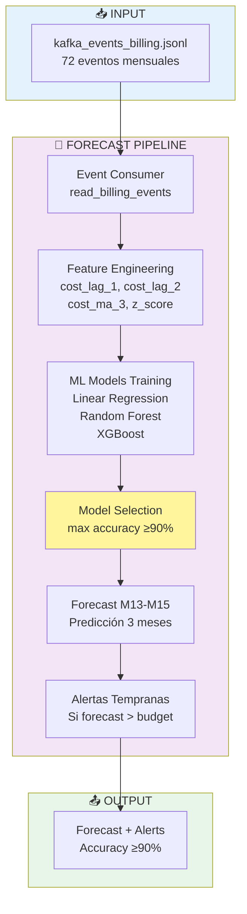
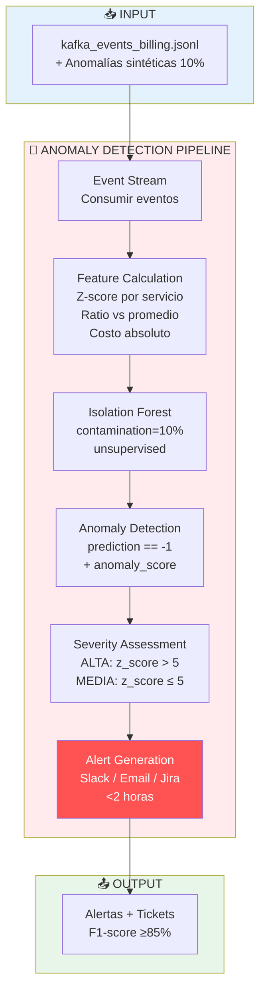

# Arquitectura del MVP de IA para FinOps

**Proyecto:** Migración Industrial a Google Cloud Platform
**Fecha:** 2025-11-01
**Versión:** 1.0

## Resumen Ejecutivo

Este MVP demuestra la viabilidad técnica y valor de negocio de aplicar IA/ML a FinOps en GCP, implementando tres casos de uso críticos mediante una arquitectura **event-driven desde el día 1**, eliminando completamente la deuda técnica.

### Principio Arquitectónico Clave

> **El MVP consume eventos desde el inicio, aunque sean simulados.**
>
> Esto permite prototipado rápido sin generar deuda técnica, porque el código del MVP **ES** el código de producción.

---

## 1. Stack Tecnológico del MVP

| Componente | Tecnología | Propósito |
|:---|:---|:---|
| **Lenguaje** | Python 3.9+ | Desarrollo de notebooks y scripts |
| **Package Manager** | `uv` | Gestión ultra-rápida de deps y venvs |
| **Notebooks** | Jupyter | Análisis interactivo y documentación |
| **ML Libraries** | scikit-learn, XGBoost | Modelos de forecast, anomalías, NLP |
| **Data Processing** | Pandas, NumPy | Manipulación de eventos y features |
| **Visualización** | Matplotlib, Seaborn | Gráficos y dashboards |
| **Event Format** | JSONL (JSON Lines) | Simulación de mensajes Kafka |
| **Datos** | Archivos locales | Eventos sintéticos en `data/` |

**Simplicidad intencional:** No se requiere Kafka, BigQuery, ni GCP durante el MVP. Todo corre localmente.

**Velocidad:** Usando `uv` en lugar de pip tradicional (10-100x más rápido para instalar dependencias).

---

## 2. Arquitectura de Datos: Event-First

### 2.1 Formato de Eventos

Todos los datos se estructuran como **eventos JSONL**, simulando exactamente el formato que producirá Kafka en producción.

#### Evento de Billing (`billing.cost.monthly`)

```json
{
  "timestamp": "2025-01-01T00:00:00Z",
  "period": "monthly",
  "month": "M1",
  "project_id": "prod-industrial-fleet",
  "service": "compute",
  "sku": "n2-standard-fleet",
  "cost_usd": 95000.0,
  "usage_amount": 684000.0,
  "usage_unit": "vCPU-hours",
  "production_units": 130000,
  "labels": {
    "env": "prod",
    "business_unit": "industrial-operations",
    "cost_center": "CC-1000"
  }
}
```

#### Evento de Producción (`production.metrics.monthly`)

```json
{
  "timestamp": "2025-01-01T00:00:00Z",
  "period": "monthly",
  "month": "M1",
  "production_units": 130000,
  "total_cost_usd": 218300.0,
  "cost_per_unit": 1.6792,
  "labels": {
    "business_unit": "industrial-operations"
  }
}
```

### 2.2 Mapeo CSV → Eventos

El CSV histórico (12 filas) se transforma en eventos manteniendo:
- **Misma granularidad** (mensual)
- **Mismos valores** (diferencia $0.00)
- **Formato Kafka-compatible**

**Resultado:**
- 60 eventos de billing (12 meses × 5 servicios)
- 12 eventos de producción (12 meses)
- **Total: 72 eventos** vs 12 filas CSV

---

## 3. Arquitectura de los 3 Casos de Uso

### 3.1 Forecast de Costos



**Métricas objetivo:**
- Accuracy ≥90%
- Alertas 15 días antes del cierre
- Ahorro: $50-100K/año

### 3.2 Detección de Anomalías



**Métricas objetivo:**
- F1-score ≥85%
- Detección <2 horas
- Ahorro: $30-50K/año

### 3.3 NLP Etiquetado Automático

```mermaid
flowchart TB
    subgraph input["📥 INPUT"]
        Unlabeled[kafka_events_billing.jsonl<br/>Recursos sin etiquetas ~20%]
    end

    subgraph pipeline["🏷️ AUTO-LABELING PIPELINE NLP"]
        Filter[Filter Unlabeled<br/>labels == {}]
        TextFeat[Text Features<br/>resource_name + project_id<br/>+ service + sku]
        TFIDF[TF-IDF Vectorizer<br/>max_features=100<br/>ngram_range 1-2]
        Classifiers[Multi-Label Classifiers<br/>owner_clf<br/>cost_center_clf<br/>plant_clf]
        Confidence[Confidence Calculation<br/>avg de 3 predicciones]
        Decision{Confidence<br/>≥75%?}
        AutoLabel[Auto-Label<br/>Aplicar etiquetas]
        Manual[Manual Review<br/>Queue para humano]
    end

    subgraph output["📤 OUTPUT"]
        Results[Label Compliance<br/>80% → 95%+]
    end

    Unlabeled --> Filter
    Filter --> TextFeat
    TextFeat --> TFIDF
    TFIDF --> Classifiers
    Classifiers --> Confidence
    Confidence --> Decision
    Decision -->|Sí| AutoLabel
    Decision -->|No| Manual
    AutoLabel --> Results
    Manual --> Results

    style input fill:#e3f2fd
    style pipeline fill:#fff3e0
    style output fill:#e8f5e9
    style Decision fill:#fff59d
    style AutoLabel fill:#4caf50,color:#fff
    style Manual fill:#ff9800,color:#fff
```

**Métricas objetivo:**
- Label compliance ≥95%
- Accuracy ≥90%
- Ahorro: $15-20K/año

---

## 4. Flujo de Ejecución del MVP

### 4.1 Setup Inicial

**Con `uv` (Recomendado - 10-100x más rápido):**

```bash
# Clonar repositorio
git clone <repo-url>
cd MVP

# Instalar uv (si no lo tienes)
curl -LsSf https://astral.sh/uv/install.sh | sh

# Crear venv + instalar dependencias (¡solo 304 ms!)
uv venv
uv pip install pandas numpy scikit-learn xgboost matplotlib seaborn jupyter ipykernel notebook

# Generar eventos desde CSV
source .venv/bin/activate
cd data
python generate_events.py
```

**Con pip tradicional:**

```bash
# Clonar repositorio
git clone <repo-url>
cd MVP

# Crear entorno virtual
python -m venv .venv
source .venv/bin/activate

# Instalar dependencias
pip install -e .

# Generar eventos desde CSV
cd data
python generate_events.py
```

**Output:**
```
✅ Generados 60 eventos de billing
✅ Generados 12 eventos de producción
📊 Total: 72 eventos
✨ Diferencia vs CSV: $0.00
```

### 4.2 Ejecución de Notebooks

**Orden de ejecución:**

1. **`00_data_generation.ipynb`**
   - Documenta el enfoque Event-First
   - Valida que eventos == CSV
   - Explora distribución de datos

2. **`01_forecast_costos.ipynb`**
   - Entrena modelos de forecast
   - Selecciona mejor modelo (accuracy ≥90%)
   - Genera forecast para M13-M15
   - Crea alertas tempranas

3. **`02_deteccion_anomalias.ipynb`**
   - Inyecta anomalías sintéticas (10%)
   - Entrena Isolation Forest
   - Valida F1-score ≥85%
   - Simula flujo de alertas

4. **`03_nlp_etiquetado.ipynb`**
   - Entrena 3 clasificadores NLP
   - Auto-etiqueta recursos huérfanos
   - Calcula nuevo compliance (≥95%)
   - Estima ahorro financiero

---

## 5. Código Reutilizable: MVP → Producción

### 5.1 Event Consumer (Genérico)

**MVP:**
```python
def read_billing_events(filepath):
    events = []
    with open(filepath, 'r') as f:
        for line in f:
            events.append(json.loads(line))
    return events

events = read_billing_events('../data/kafka_events_billing.jsonl')
```

**Producción** (solo cambiar esta función):
```python
from kafka import KafkaConsumer

def read_billing_events(topic='billing.cost.monthly'):
    consumer = KafkaConsumer(
        topic,
        bootstrap_servers=['kafka-hub.gcp.internal:9092'],
        value_deserializer=lambda m: json.loads(m.decode('utf-8'))
    )
    events = [msg.value for msg in consumer]
    return events

events = read_billing_events()  # ← MISMO código después
```

### 5.2 Feature Engineering (Idéntico)

```python
# Este código NO cambia entre MVP y producción
df = pd.DataFrame(events)
df['z_score'] = (df['cost_usd'] - df['service_mean']) / df['service_std']
df['cost_ratio'] = df['cost_usd'] / df['service_mean']
```

### 5.3 ML Pipeline (Idéntico)

```python
# Este código NO cambia entre MVP y producción
model = RandomForestClassifier(n_estimators=100)
model.fit(X_train, y_train)
predictions = model.predict(X_test)
```

**Clave:** Solo cambia la **fuente de eventos**, no el pipeline de ML.

---

## 6. Validación de Objetivos del MVP

| Objetivo | Meta | Método de Validación | Notebook |
|:---|:---|:---|:---|
| **Forecast Accuracy** | ≥90% | MAPE en test set (M10-M12) | `01_forecast_costos.ipynb` |
| **Anomaly F1-Score** | ≥85% | F1 con anomalías sintéticas | `02_deteccion_anomalias.ipynb` |
| **Label Compliance** | ≥95% | % recursos etiquetados post-ML | `03_nlp_etiquetado.ipynb` |
| **Event Parity** | $0 diff | Total eventos vs CSV | `00_data_generation.ipynb` |

---

## 7. Limitaciones del MVP (Intencionales)

### 7.1 Datos Sintéticos

- **MVP:** Eventos generados desde CSV histórico
- **Producción:** Eventos reales desde Kafka

**Impacto:** Ninguno. El pipeline es idéntico.

### 7.2 Entrenamiento Local

- **MVP:** Modelos entrenados en Jupyter local
- **Producción:** Vertex AI AutoML + retraining automático

**Impacto:** Modelos del MVP sirven como baseline. Vertex AI mejorará accuracy.

### 7.3 Sin Persistencia

- **MVP:** Modelos en memoria durante ejecución del notebook
- **Producción:** Modelos en Vertex AI Model Registry

**Impacto:** Fácil migración con `model.save()` → Vertex AI.

### 7.4 Batch Processing

- **MVP:** Procesar todos los eventos de una vez
- **Producción:** Stream processing evento por evento

**Impacto:** Código ya está preparado (`detect_anomaly_realtime()` procesa 1 evento).

---

## 8. Requisitos del Entorno

### 8.1 Hardware Mínimo

- **CPU:** 2 cores
- **RAM:** 4 GB
- **Disco:** 1 GB libre

**Razón:** Procesamos solo 72 eventos, modelos pequeños.

### 8.2 Software

**Instalación rápida con `uv`:**
```bash
# Instalar uv
curl -LsSf https://astral.sh/uv/install.sh | sh

# Instalar dependencias
cd MVP
uv venv
uv pip install pandas numpy scikit-learn xgboost matplotlib seaborn jupyter ipykernel notebook
```

**Dependencias (definidas en `pyproject.toml`):**
- Python 3.9+
- pandas>=1.5.0
- numpy>=1.23.0
- scikit-learn>=1.2.0
- xgboost>=1.7.0
- matplotlib>=3.6.0
- seaborn>=0.12.0
- jupyter>=1.0.0

### 8.3 No se Requiere

- ❌ GCP Account
- ❌ Kafka instalado
- ❌ BigQuery
- ❌ Vertex AI
- ❌ Conectividad a internet (excepto para instalar deps)

**Ventaja:** El MVP corre 100% offline, ideal para demos y validación.

---

## 9. Próximos Pasos

Ver `arquitectura_productiva.md` para:
- Migración a Kafka
- Integración con Vertex AI
- Deployment en GKE
- Automatización con Cloud Scheduler

Ver `plan_implementacion.md` para:
- Plan 30-60-90 días
- Hitos y deliverables
- Estrategia de adopción
