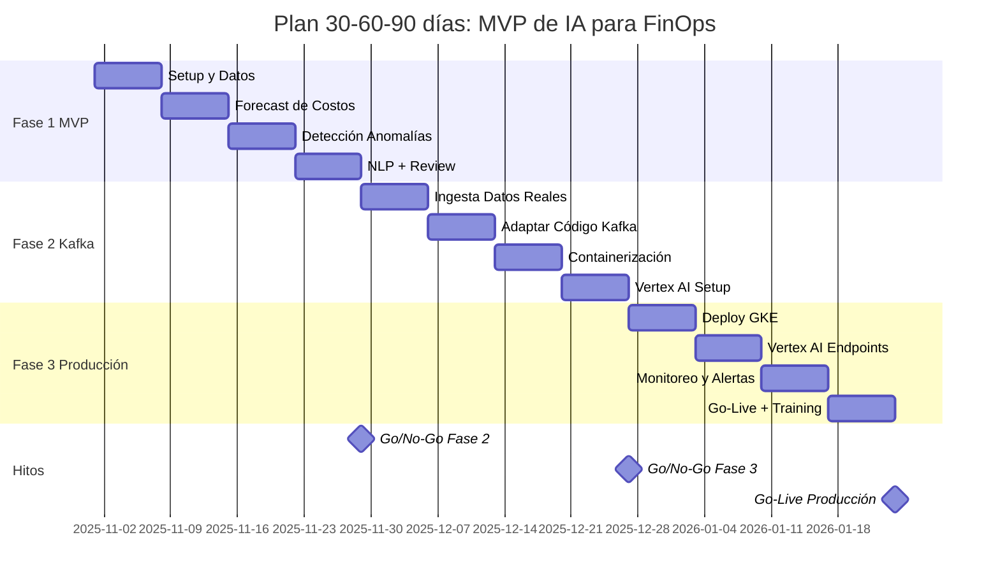

# Plan de Implementación MVP a Producción (30-60-90 días)

**Proyecto:** MVP de IA para FinOps - Migración Industrial a GCP
**Fecha Inicio:** 2025-11-01
**Duración:** 90 días
**Owner:** Líder de Arquitectura Cloud & FinOps

---

## Resumen Ejecutivo

Este plan describe la implementación del MVP de IA para FinOps en 3 fases de 30 días cada una, siguiendo el enfoque Event-First para llegar a producción sin deuda técnica.

**Meta:** Sistema productivo de Forecast, Anomaly Detection y Auto-Labeling funcionando en 90 días.

### Timeline Visual

---

## Fase 1: MVP Local (Días 1-30)

### Objetivo

Demostrar viabilidad técnica con código que funcionará en producción.

### Semana 1 (Días 1-7): Setup y Generación de Datos

| Día | Actividad | Entregable | Owner |
|:---|:---|:---|:---|
| 1 | Kickoff del proyecto | Presentación a stakeholders | PM |
| 2 | Setup de entorno de desarrollo | Python 3.9+, Jupyter instalado | ML Engineer |
| 3 | Análisis del CSV histórico | Documento de hallazgos | Data Analyst |
| 4 | Diseño de esquema de eventos | Especificación JSONL | Architect |
| 5 | Implementar `generate_events.py` | Script funcional | ML Engineer |
| 6 | Generar eventos sintéticos | 72 eventos validados ($0 diff) | ML Engineer |
| 7 | Crear notebook 00 (Data Generation) | Notebook documentado | ML Engineer |

**Criterio de éxito:**
- ✅ Eventos JSONL generados
- ✅ Total eventos == Total CSV (diferencia $0.00)
- ✅ Notebook 00 valida enfoque Event-First

### Semana 2 (Días 8-14): Forecast de Costos

| Día | Actividad | Entregable | Owner |
|:---|:---|:---|:---|
| 8 | Feature engineering para forecast | Features documentadas | ML Engineer |
| 9 | Entrenar Linear Regression (baseline) | Modelo baseline | ML Engineer |
| 10 | Entrenar Random Forest | Modelo RF | ML Engineer |
| 11 | Entrenar XGBoost | Modelo XGB | ML Engineer |
| 12 | Comparar modelos y seleccionar mejor | Análisis comparativo | ML Engineer |
| 13 | Implementar forecast M13-M15 | Predicciones futuras | ML Engineer |
| 14 | Crear sistema de alertas tempranas | Lógica de alertas | ML Engineer |

**Criterio de éxito:**
- ✅ Accuracy ≥90% en test set
- ✅ Forecast para próximos 3 meses
- ✅ Notebook 01 completo y documentado

### Semana 3 (Días 15-21): Detección de Anomalías

| Día | Actividad | Entregable | Owner |
|:---|:---|:---|:---|
| 15 | Inyectar anomalías sintéticas (10%) | Dataset con anomalías | ML Engineer |
| 16 | Feature engineering para anomalías | Features (z-score, ratios) | ML Engineer |
| 17 | Entrenar Isolation Forest | Modelo entrenado | ML Engineer |
| 18 | Validar F1-score con anomalías conocidas | Métricas de validación | ML Engineer |
| 19 | Implementar generación de alertas | Sistema de alertas | ML Engineer |
| 20 | Simular procesamiento en tiempo real | Función `detect_anomaly_realtime()` | ML Engineer |
| 21 | Crear notebook 02 (Anomaly Detection) | Notebook completo | ML Engineer |

**Criterio de éxito:**
- ✅ F1-score ≥85%
- ✅ Detección funciona evento por evento
- ✅ Notebook 02 completo y documentado

### Semana 4 (Días 22-30): NLP Etiquetado + Review

| Día | Actividad | Entregable | Owner |
|:---|:---|:---|:---|
| 22 | Preparar dataset de recursos etiquetados | Train/test split | ML Engineer |
| 23 | TF-IDF vectorización | Vectorizer entrenado | ML Engineer |
| 24 | Entrenar Owner classifier | Modelo owner | ML Engineer |
| 25 | Entrenar Cost Center classifier | Modelo cost_center | ML Engineer |
| 26 | Entrenar Plant classifier | Modelo plant | ML Engineer |
| 27 | Auto-etiquetar recursos huérfanos | Compliance ≥95% | ML Engineer |
| 28 | Calcular ROI y savings | Documento financiero | FinOps Lead |
| 29 | Demo interna del MVP | Presentación ejecutiva | PM + ML Engineer |
| 30 | Go/No-Go meeting para Fase 2 | Decisión aprobada | Sponsor |

**Criterio de éxito:**
- ✅ Accuracy ≥90% en clasificación
- ✅ Label compliance 80% → 95%+
- ✅ Notebooks 03 completo
- ✅ Aprobación para continuar a Fase 2

**Deliverables Fase 1:**
- 4 Jupyter notebooks funcionando
- Documentación técnica completa
- Demo funcional del MVP
- Business case validado

---

## Fase 2: Integración con Kafka (Días 31-60)

### Objetivo

Conectar el código del MVP a la infraestructura Kafka real sin refactoring.

### Semana 5 (Días 31-37): Ingesta de Datos Reales

| Día | Actividad | Entregable | Owner |
|:---|:---|:---|:---|
| 31 | Configurar GCP Billing Export a GCS | Export activo | Cloud Engineer |
| 32 | Implementar Cloud Function (GCS → Kafka) | Function deployada | ML Engineer |
| 33 | Crear topics Kafka de producción | Topics creados | Platform Architect |
| 34 | Configurar permisos IAM | Permisos configurados | Security Engineer |
| 35 | Testing: CSV → Kafka → Consumer | Flujo validado | ML Engineer |
| 36 | Monitorear throughput y latencia | Métricas baseline | SRE |
| 37 | Validar schema de eventos | Eventos == MVP format | ML Engineer |

**Criterio de éxito:**
- ✅ Eventos reales fluyendo a Kafka
- ✅ Schema compatible con MVP
- ✅ Latencia <1 minuto (export → topic)

### Semana 6 (Días 38-44): Adaptar Código a Kafka

| Día | Actividad | Entregable | Owner |
|:---|:---|:---|:---|
| 38 | Crear función `read_kafka_events()` | Función genérica | ML Engineer |
| 39 | Adaptar notebook 01 (Forecast) | Notebook + Kafka | ML Engineer |
| 40 | Adaptar notebook 02 (Anomaly) | Notebook + Kafka | ML Engineer |
| 41 | Adaptar notebook 03 (Auto-label) | Notebook + Kafka | ML Engineer |
| 42 | Testing end-to-end | Todos notebooks OK | ML Engineer |
| 43 | Comparar resultados MVP vs Kafka | Análisis de diferencias | Data Analyst |
| 44 | Documentar cambios realizados | <5 líneas cambiadas! | ML Engineer |

**Criterio de éxito:**
- ✅ Notebooks funcionan con Kafka
- ✅ Accuracy mantiene ≥90%
- ✅ Solo ~3-5 líneas de código cambiadas

### Semana 7 (Días 45-51): Containerización

| Día | Actividad | Entregable | Owner |
|:---|:---|:---|:---|
| 45 | Convertir notebooks a scripts Python | Scripts .py | ML Engineer |
| 46 | Crear Dockerfile para Forecast Service | Dockerfile | DevOps Engineer |
| 47 | Crear Dockerfile para Anomaly Detector | Dockerfile | DevOps Engineer |
| 48 | Crear Dockerfile para Auto-Label Service | Dockerfile | DevOps Engineer |
| 49 | Build images y push a GCR | Images en GCR | DevOps Engineer |
| 50 | Testing local con Docker Compose | Docker compose OK | ML Engineer |
| 51 | Documentar arquitectura de containers | Diagrama actualizado | Architect |

**Criterio de éxito:**
- ✅ 3 servicios containerizados
- ✅ Images en Google Container Registry
- ✅ Testing local exitoso

### Semana 8 (Días 52-60): Vertex AI Setup

| Día | Actividad | Entregable | Owner |
|:---|:---|:---|:---|
| 53 | Crear Vertex AI Feature Store | Feature Store creado | ML Engineer |
| 54 | Definir features y entities | Schema definido | ML Engineer |
| 55 | Implementar ingesta Kafka → Feature Store | Pipeline funcional | ML Engineer |
| 56 | Subir modelos a Model Registry | 3 modelos registrados | ML Engineer |
| 57 | Crear pipeline de retraining | Pipeline en Vertex AI | ML Engineer |
| 58 | Testing de Feature Store | Lectura/escritura OK | ML Engineer |
| 59 | Documentar flujo Vertex AI | Documentación | ML Engineer |
| 60 | Demo Fase 2 + Go/No-Go | Decisión para Fase 3 | PM |

**Criterio de éxito:**
- ✅ Feature Store operativo
- ✅ Modelos en Vertex AI
- ✅ Pipeline de retraining configurado
- ✅ Aprobación para Fase 3

**Deliverables Fase 2:**
- Eventos reales desde Kafka
- 3 servicios containerizados
- Vertex AI Feature Store configurado
- Modelos registrados en Vertex AI

---

## Fase 3: Despliegue en Producción (Días 61-90)

### Objetivo

Sistema completamente productivo con SLOs, monitoreo y alertas.

### Semana 9 (Días 61-67): Deploy a GKE

| Día | Actividad | Entregable | Owner |
|:---|:---|:---|:---|
| 61 | Crear namespace en GKE | Namespace creado | DevOps Engineer |
| 62 | Deploy Forecast Service | Service running | DevOps Engineer |
| 63 | Deploy Anomaly Detector | Service running | DevOps Engineer |
| 64 | Deploy Auto-Label Service | Service running | DevOps Engineer |
| 65 | Configurar Load Balancers | LBs configurados | DevOps Engineer |
| 66 | Configurar HPA (autoscaling) | HPA activo | DevOps Engineer |
| 67 | Testing de servicios deployados | Smoke tests OK | SRE |

**Criterio de éxito:**
- ✅ 3 servicios corriendo en GKE
- ✅ Load balancers funcionando
- ✅ Autoscaling configurado

### Semana 10 (Días 68-74): Vertex AI Endpoints

| Día | Actividad | Entregable | Owner |
|:---|:---|:---|:---|
| 68 | Deploy Forecast endpoint | Endpoint activo | ML Engineer |
| 69 | Deploy Anomaly endpoint | Endpoint activo | ML Engineer |
| 70 | Deploy Auto-Label endpoint | Endpoint activo | ML Engineer |
| 71 | Configurar traffic splitting (A/B) | Splitting configurado | ML Engineer |
| 72 | Testing de endpoints | Latencia <200ms | ML Engineer |
| 73 | Configurar monitoreo de modelos | Dashboards creados | ML Engineer |
| 74 | Documentar APIs | API documentation | ML Engineer |

**Criterio de éxito:**
- ✅ 3 endpoints en producción
- ✅ Latencia p99 <200ms
- ✅ Availability ≥99.5%

### Semana 11 (Días 75-81): Monitoreo y Alertas

| Día | Actividad | Entregable | Owner |
|:---|:---|:---|:---|
| 75 | Configurar Cloud Monitoring | Dashboards básicos | SRE |
| 76 | Configurar alertas (SLO violations) | Alerting rules | SRE |
| 77 | Integrar Slack webhooks | Alerts en Slack | DevOps Engineer |
| 78 | Configurar email alerts | Email configurado | DevOps Engineer |
| 79 | Crear Looker dashboards FinOps | 3 dashboards | BI Analyst |
| 80 | Testing de alertas end-to-end | Alerts funcionando | SRE |
| 81 | Documentar runbooks | Runbooks para on-call | SRE |

**Criterio de éxito:**
- ✅ Monitoreo 24/7
- ✅ Alertas automáticas funcionando
- ✅ Dashboards accesibles para stakeholders

### Semana 12 (Días 82-90): Producción + Training

| Día | Actividad | Entregable | Owner |
|:---|:---|:---|:---|
| 82 | Configurar Cloud Scheduler (retraining) | Jobs programados | ML Engineer |
| 83 | Pruebas de carga (load testing) | Reporte de performance | SRE |
| 84 | Ajustes de performance | Optimizaciones | ML Engineer |
| 85 | Training para equipo FinOps | Sesión de capacitación | ML Engineer |
| 86 | Training para equipo SRE | Sesión de capacitación | SRE Lead |
| 87 | Documentación de usuario final | User guide | Technical Writer |
| 88 | Handoff a operations | Knowledge transfer | PM |
| 89 | Demo ejecutiva final | Presentación a C-level | Sponsor |
| 90 | Go-Live celebration 🎉 | Sistema en producción | Team |

**Criterio de éxito:**
- ✅ Sistema handling carga de producción
- ✅ Equipo entrenado
- ✅ Documentación completa
- ✅ Go-Live exitoso

**Deliverables Fase 3:**
- Sistema 100% productivo
- SLOs configurados y monitoreados
- Equipos entrenados
- Runbooks y documentación

---

## Hitos y Go/No-Go Gates

| Día | Hito | Criterio de Éxito | Escalamiento |
|:---|:---|:---|:---|
| **30** | MVP Completo | Accuracy ≥90%, F1≥85%, Compliance≥95% | Sponsor |
| **60** | Kafka Integration | Eventos reales, Vertex AI setup | Sponsor |
| **90** | Go-Live | SLOs cumplidos, equipo entrenado | Sponsor |

**En cada gate:**
- Demo del progreso
- Review de métricas
- Decisión Go/No-Go
- Ajuste de timeline si necesario

---

## Equipo y Roles

| Rol | Responsabilidad | Dedicación | Personas |
|:---|:---|:---|:---|
| **ML Engineer** | Desarrollo de modelos, notebooks, código | Full-time | 1 |
| **DevOps Engineer** | Containerización, deployment, CI/CD | 50% | 1 |
| **Platform Architect** | Diseño Kafka, Vertex AI, arquitectura | 25% | 1 |
| **Data Analyst** | Análisis de datos, validación | 25% | 1 |
| **Cloud Engineer** | GCP setup, permisos, networking | 25% | 1 |
| **SRE** | Monitoreo, alertas, runbooks | 25% (50% semana 11-12) | 1 |
| **FinOps Lead** | Validación de negocio, ROI | 10% | 1 |
| **Security Engineer** | IAM, secrets, compliance | 10% | 1 |
| **PM** | Coordinación, stakeholders, reporting | 50% | 1 |

**Total FTE equivalente:** ~3 FTE durante 90 días

---

## Presupuesto Estimado

### CAPEX (One-time)

| Item | Cantidad | Costo Unitario | Total |
|:---|---:|---:|---:|
| ML Engineer (3 meses) | 1 | $15,000/mes | $45,000 |
| DevOps Engineer (1.5 meses equiv) | 0.5 | $13,000/mes | $19,500 |
| Otros recursos (partial) | 1.5 | $10,000/mes | $45,000 |
| **TOTAL CAPEX** |  |  | **$109,500** |

### OPEX (Mensual post-implementación)

| Item | Costo Mensual |
|:---|---:|
| GKE Cluster (3 nodes) | $146 |
| Vertex AI Endpoints | $73 |
| Vertex AI Feature Store | $50 |
| BigQuery | $60 |
| Cloud Functions | $10 |
| Networking + Storage | $22 |
| **TOTAL OPEX** | **$361/mes** |

### ROI

**Ahorro anual estimado:** $95,000 - $170,000
**Inversión total (año 1):** $109,500 + ($361 × 12) = $113,832
**ROI año 1:** 84% - 149%
**Payback period:** 7-14 meses

---

## Riesgos y Mitigaciones

| Riesgo | Probabilidad | Impacto | Mitigación |
|:---|:---|:---|:---|
| **Accuracy <90% en MVP** | Media | Alto | Usar más features, probar modelos alternativos |
| **Eventos Kafka schema diferente** | Baja | Alto | Validación temprana en Fase 2 Semana 5 |
| **Performance issues en GKE** | Media | Medio | Load testing en Semana 12, ajustar recursos |
| **Equipo sin disponibilidad** | Alta | Alto | Plan B con consultores externos |
| **Stakeholder pushback** | Baja | Alto | Demos frecuentes, mostrar valor temprano |
| **Kafka cluster issues** | Baja | Alto | Kafka ya existe y es estable |
| **Budget overrun** | Media | Medio | Monitoreo semanal de costos GCP |

---

## Comunicación y Reporting

### Frecuencia de Reportes

- **Daily standups:** Equipo técnico (15 min)
- **Weekly status:** PM → Sponsor (30 min)
- **Bi-weekly demos:** Equipo → Stakeholders (1 hora)
- **Monthly reviews:** Sponsor → C-level (30 min)

### KPIs Tracked

| KPI | Frecuencia | Owner |
|:---|:---|:---|
| Accuracy de modelos | Semanal | ML Engineer |
| Cumplimiento de timeline | Semanal | PM |
| Presupuesto usado vs plan | Semanal | PM |
| Eventos procesados/día | Diario (post Fase 2) | SRE |
| SLO violations | Diario (post Fase 3) | SRE |

---

## Change Management

### Stakeholder Engagement

| Stakeholder | Rol | Frecuencia Engagement |
|:---|:---|:---|
| **CFO** | Sponsor ejecutivo | Mensual |
| **CTO/CIO** | Aprobador técnico | Bi-weekly |
| **Equipo FinOps** | Usuario final | Semanal |
| **Equipo SRE** | Operador | Semanal |
| **Equipo Platform** | Proveedor infraestructura | Semanal |

### Training Plan

| Audiencia | Contenido | Duración | Fecha |
|:---|:---|:---|:---|
| **FinOps Team** | Cómo usar dashboards, interpretar forecasts | 2 horas | Día 85 |
| **SRE Team** | Runbooks, troubleshooting, alertas | 3 horas | Día 86 |
| **Leadership** | Business value, KPIs, roadmap | 1 hora | Día 89 |

---

## Criterios de Éxito Final (Día 90)

### Métricas Técnicas
- ✅ Forecast accuracy ≥90%
- ✅ Anomaly F1-score ≥85%
- ✅ Label compliance ≥95%
- ✅ API latency p99 <200ms
- ✅ System availability ≥99.5%

### Métricas de Negocio
- ✅ TCO reduction: $95K-$170K/año validado
- ✅ Time to detection: <2 horas (vs 1-2 semanas)
- ✅ Manual labeling time: -30+ horas/mes
- ✅ Forecast lead time: +15 días

### Métricas de Proyecto
- ✅ Timeline: ≤90 días
- ✅ Presupuesto: ≤$115K
- ✅ Zero technical debt
- ✅ Team trained and confident

---

## Conclusión

Este plan de 90 días lleva el MVP de IA para FinOps desde concepto hasta producción completa, aprovechando la arquitectura Event-First para:

1. **Velocidad:** 90 días vs 6+ meses tradicional
2. **Calidad:** Cero deuda técnica, código del MVP ES el código productivo
3. **Valor:** $95K-$170K/año de ahorro con inversión de ~$115K
4. **Riesgo:** Validación temprana en cada fase con Go/No-Go gates

**El enfoque Event-First hace posible llegar a producción en 90 días porque el tiempo invertido en el MVP NO se desperdicia: es inversión directa en producción.**

---

**Aprobaciones:**

| Rol | Nombre | Firma | Fecha |
|:---|:---|:---|:---|
| Sponsor | CFO |  |  |
| Technical Lead | CTO/CIO |  |  |
| Project Manager |  |  |  |
| ML Engineer Lead |  |  |  |
