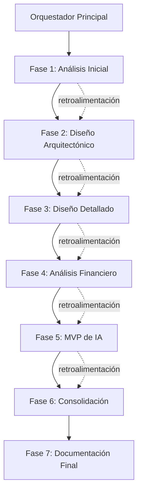
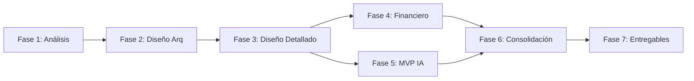

# Plan Maestro para Resolución del Caso de Negocio
## Migración y Operación en Google Cloud con Gobierno FinOps e IA

---

**Proyecto**: Migración Industrial a GCP con Arquitectura Event-Driven
**Timeline**: 5 días calendario (intensivo)
**Fecha Inicio**: 2025-10-31
**Versión**: 1.0

---

## Tabla de Contenidos

1. [Objetivo del Plan](#objetivo-del-plan)
2. [Arquitectura de Orquestación](#arquitectura-de-orquestación)
3. [Fases de Ejecución](#fases-de-ejecución)
4. [Matriz de Dependencias](#matriz-de-dependencias)
5. [Entregables por Fase](#entregables-por-fase)
6. [Criterios de Éxito](#criterios-de-éxito)
7. [Plan de Contingencia](#plan-de-contingencia)
8. [Recuperación de Contexto](#recuperación-de-contexto)

---

## Objetivo del Plan

Este plan documenta la estrategia de orquestación de 8 sub-agentes especializados para resolver el caso de negocio de forma sistemática, simulando un equipo real que colabora, se retroalimenta y converge hacia una solución integral.

### Principios de Orquestación

1. **Trabajo Colaborativo**: Los agentes NO trabajan en silos, se retroalimentan constantemente
2. **Iteración Incremental**: Cada fase refina los resultados de la anterior
3. **Validación Cruzada**: Un agente revisa y cuestiona las decisiones de otros
4. **Convergencia hacia Consenso**: Discrepancias se resuelven mediante análisis comparativo
5. **Documentación Continua**: Cada iteración genera artefactos incrementales

---

## Arquitectura de Orquestación

### Modelo de Comunicación



### Equipos por Fase

**Equipo Arquitectura** (Fases 1-3):
- Arquitecto de Plataforma (líder)
- Arquitecto de Datos
- Experto en Redes
- Admin Sistemas Legados

**Equipo Implementación** (Fases 3-4):
- Data Engineer (líder)
- DevSecOps
- Admin Sistemas Legados

**Equipo FinOps e IA** (Fases 4-5):
- Finanzas (líder)
- Data Scientist
- Arquitecto de Plataforma

**Equipo Consolidación** (Fases 6-7):
- Todos los agentes

---

## Fases de Ejecución

### FASE 1: Análisis de Situación Actual y Restricciones (4 horas)

**Objetivo**: Entender profundamente el estado actual, restricciones críticas y requisitos del negocio.

#### Secuencia de Ejecución

**1.1 Admin Sistemas Legados** (Primera ejecución, 60 min)
- **Tarea**: Generar inventario detallado de sistemas actuales
- **Entregables**:
  - Tabla completa de 380 sistemas con: tipo, versión, ubicación, criticidad, RPO/RTO, dependencias
  - Identificación de sistemas con .exe locales (stored procedures)
  - Análisis de SCADA antiguos: fabricante, protocolo, latencia requerida
  - Evaluación de capacidad VMware actual para Tanzu
- **Output**: `docs/fase1/inventario-sistemas-legados.md`

**1.2 Finanzas** (Primera ejecución, 45 min)
- **Tarea**: Establecer baseline financiero y restricciones presupuestarias
- **Entregables**:
  - TCO on-premise actual (validado)
  - Unit economics actual (USD/unidad producida)
  - Presupuesto disponible para migración (CAPEX)
  - Restricciones de OPEX mensual/anual
- **Output**: `docs/fase1/baseline-financiero.md`

**1.3 Experto en Redes** (Primera ejecución, 45 min)
- **Tarea**: Evaluar conectividad actual y requisitos de latencia
- **Entregables**:
  - Inventario de conectividad actual (Interconnect, WAN, enlaces plantas)
  - Medición/estimación de latencias críticas
  - Análisis de ancho de banda disponible vs requerido
  - Evaluación de capacidad Interconnect 1Gbps
- **Output**: `docs/fase1/conectividad-actual.md`

**1.4 Sesión de Retroalimentación** (30 min)
- **Participantes**: Admin Legados, Finanzas, Redes
- **Tarea**: Validar supuestos cruzados
  - ¿El throughput de CDC de 160 SQL Server cabe en Interconnect 1Gbps?
  - ¿Los costos on-premise incluyen todos los hidden costs?
  - ¿SCADA antiguos realmente pueden esperar latencia cloud o requieren edge?
- **Output**: `docs/fase1/supuestos-validados.md`

---

### FASE 2: Diseño Arquitectónico de Alto Nivel (6 horas)

**Objetivo**: Definir la arquitectura de plataforma, datos y redes que cumple con requisitos críticos.

#### Secuencia de Ejecución

**2.1 Arquitecto de Plataforma** (Primera ejecución, 90 min)
- **Tarea**: Diseñar arquitectura de plataforma distribuida basada en Kafka
- **Input**: Inventario de legados (Fase 1.1), conectividad (Fase 1.3)
- **Entregables**:
  - Topología de clusters Kafka (on-prem + GCP multi-región)
  - Justificación: Confluent Kafka vs Pub/Sub vs Spanner
  - Justificación: Cluster Linking vs MirrorMaker 2 (RPO/RTO=0)
  - Patrón HA/DR para sistemas críticos (activo-activo/activo-pasivo)
  - Estrategia edge computing para SCADA antiguos
  - Diagrama Mermaid de arquitectura
- **Output**: `docs/fase2/arquitectura-plataforma.md`

**2.2 Arquitecto de Datos** (Primera ejecución, 90 min)
- **Tarea**: Diseñar data hub y capas medallion
- **Input**: Arquitectura de plataforma (2.1), inventario legados (1.1)
- **Entregables**:
  - Flujo de datos end-to-end (diagrama Mermaid)
  - Capas medallion: RAW → Bronze → Silver → Gold (justificar cuántas)
  - Catálogo de tópicos Kafka (naming, particiones, retención)
  - Estrategia de particionamiento (por planta, sensor, etc.)
  - Schema management (Avro, Protobuf, JSON)
  - Lakehouse vs BigQuery (análisis comparativo)
- **Output**: `docs/fase2/arquitectura-datos.md`

**2.3 Experto en Redes** (Segunda ejecución, 90 min)
- **Tarea**: Diseñar backbone de red con Cloudflare Zero Trust
- **Input**: Arquitectura plataforma (2.1), arquitectura datos (2.2), conectividad actual (1.3)
- **Entregables**:
  - Arquitectura Cloudflare Zero Trust (3 capas: Access, Private Networks, WARP VPN)
  - Justificación: NO usar Layer 3 tradicional, Interconnect/VPN solo como habilitador
  - Diagrama de red (Mermaid)
  - Matriz de latencias (todos los trayectos críticos)
  - Dimensionamiento de ancho de banda (¿1Gbps suficiente o upgrade?)
  - Políticas de Cloudflare Access (OAuth, mTLS)
- **Output**: `docs/fase2/arquitectura-redes.md`

**2.4 Sesión de Revisión Arquitectónica** (60 min)
- **Participantes**: Arquitecto Plataforma, Arquitecto Datos, Experto Redes, Admin Legados
- **Tarea**: Validación cruzada de decisiones arquitectónicas
  - **Arquitecto Datos cuestiona a Arquitecto Plataforma**:
    - "¿Por qué 4 clusters Kafka y no 3? ¿Justifica el costo?"
    - "¿Cluster Linking realmente ofrece sub-segundo o es marketing?"
  - **Experto Redes cuestiona a Arquitecto Plataforma**:
    - "El throughput agregado de Kafka replicación es 2.5 Gbps, Interconnect es 1Gbps, ¿cómo resuelves?"
  - **Admin Legados cuestiona a todos**:
    - "SCADA antiguos tienen latencia <10ms on-prem, en cloud será >50ms, ¿operación local-first es realmente suficiente?"
- **Decisiones**: Ajustes a arquitectura basados en retroalimentación
- **Output**: `docs/fase2/revision-arquitectonica-v1.md`

**2.5 Arquitectos refinan diseños** (30 min cada uno)
- Arquitecto Plataforma actualiza: `docs/fase2/arquitectura-plataforma-v2.md`
- Arquitecto Datos actualiza: `docs/fase2/arquitectura-datos-v2.md`
- Experto Redes actualiza: `docs/fase2/arquitectura-redes-v2.md`

---

### FASE 3: Diseño Detallado e Implementación (6 horas)

**Objetivo**: Especificar pipelines, GitOps, seguridad y operación en detalle técnico.

#### Secuencia de Ejecución

**3.1 Data Engineer** (Primera ejecución, 90 min)
- **Tarea**: Diseñar pipelines de datos con KSQL y Spark Streaming
- **Input**: Arquitectura datos v2 (2.5), tópicos Kafka (2.2)
- **Entregables**:
  - Catálogo de pipelines (KSQL vs Spark, justificación por caso de uso)
  - Implementación de capas medallion (código KSQL + Spark)
  - Estrategia de windowing (tumbling, sliding, session)
  - Exactly-once semantics (configuración, validación)
  - Manejo de late-arriving data (watermarks)
  - Plan de testing (corrección, performance, resiliencia)
  - Análisis de costos (KSQL, Spark, GCS, BigQuery)
- **Output**: `docs/fase3/pipelines-datos.md`

**3.2 DevSecOps** (Primera ejecución, 90 min)
- **Tarea**: Definir GitOps, Harness, OPA y gobierno
- **Input**: Arquitectura plataforma v2 (2.5), arquitectura datos v2 (2.5)
- **Entregables**:
  - Arquitectura GitOps (Harness + Tanzu + GKE, diagrama Mermaid)
  - Justificación: Harness vs ArgoCD/Flux
  - Especificación de políticas OPA (cuotas, seguridad, compliance)
  - Catálogo de experimentos Chaos Engineering (RPO/RTO=0)
  - Matriz RACI del modelo operativo
  - Métricas DORA y SPACE (objetivos)
  - Plan de seguridad (IAM, KMS, VPC-SC, secrets)
  - Plan FinOps 30-60-90 días
- **Output**: `docs/fase3/devsecops-gobierno.md`

**3.3 Admin Sistemas Legados** (Segunda ejecución, 90 min)
- **Tarea**: Estrategia de migración de sistemas legados
- **Input**: Arquitectura plataforma v2 (2.5), pipelines (3.1)
- **Entregables**:
  - Estrategia edge computing para SCADA (componentes, sincronización)
  - Matriz de decisión: migración SQL Server (Cloud SQL vs SQL MI vs GCE)
  - Estrategia CDC con Debezium (configuración, monitoreo, rollback)
  - Plan de transformación .exe locales (contenedores, Cloud Functions)
  - Topología VMware Tanzu on-premise (sizing, workloads, integración GKE)
  - Plan de migración por ondas (3 ondas con detalle)
  - Runbooks de escalación (failover, rollback, troubleshooting)
- **Output**: `docs/fase3/migracion-legados.md`

**3.4 Sesión de Validación Técnica** (60 min)
- **Participantes**: Data Engineer, DevSecOps, Admin Legados, Arquitecto Plataforma
- **Tarea**: Validar viabilidad técnica de implementación
  - **DevSecOps cuestiona a Data Engineer**:
    - "¿Cómo deployamos pipelines KSQL/Spark con GitOps? ¿CI/CD específico?"
    - "¿Los tests de exactly-once son automatizables en Harness?"
  - **Admin Legados cuestiona a Data Engineer**:
    - "CDC de Debezium genera 500 Mbps, ¿pipeline KSQL puede procesar sin lag?"
  - **Arquitecto Plataforma cuestiona a Admin Legados**:
    - "Edge gateway para SCADA, ¿hardware dedicado o VM? ¿Costo?"
- **Decisiones**: Ajustes a diseño de implementación
- **Output**: `docs/fase3/validacion-tecnica-v1.md`

**3.5 Refinamiento de diseños** (30 min cada uno)
- Data Engineer actualiza: `docs/fase3/pipelines-datos-v2.md`
- DevSecOps actualiza: `docs/fase3/devsecops-gobierno-v2.md`
- Admin Legados actualiza: `docs/fase3/migracion-legados-v2.md`

---

### FASE 4: Análisis Financiero y Optimización (4 horas)

**Objetivo**: Modelo financiero completo, TCO, CUD/RI, unit economics y escenarios.

#### Secuencia de Ejecución

**4.1 Finanzas** (Segunda ejecución, 120 min)
- **Tarea**: Modelo financiero 3 años con TCO y optimización
- **Input**: Todas las arquitecturas v2 (fases 2-3), plan migración (3.3)
- **Entregables**:
  - Modelo TCO 3 años (on-prem vs cloud, sin/con optimización)
  - CAPEX/OPEX por mes (rampa de migración de 18 meses)
  - Unit economics (USD/unidad producida, on-prem vs cloud)
  - Plan CUD/RI por ola (cobertura ≥60% a 12 meses)
  - Análisis de sensibilidad (escenarios: base, optimista, adverso)
  - Payback y ROI
  - Framework FinOps (KPIs, budgets, showback/chargeback)
  - Business case presentation (slides para CEO/CFO)
- **Output**: `docs/fase4/modelo-financiero.md` + `docs/fase4/modelo-financiero.xlsx`

**4.2 Sesión de Revisión Financiera** (60 min)
- **Participantes**: Finanzas (líder), Arquitecto Plataforma, Experto Redes, Data Engineer
- **Tarea**: Validar supuestos de costos y optimizaciones
  - **Arquitecto Plataforma valida**:
    - Costo Confluent Cloud (4 clusters): ¿USD 200K/año es realista?
    - Cast.ai 40% ahorro: ¿Benchmarks reales o estimado?
  - **Experto Redes valida**:
    - Costo Cloudflare Zero Trust: ¿USD 7/usuario/mes × cuántos usuarios?
    - ¿Interconnect upgrade a 10Gbps necesario? (+USD 7K/mes)
  - **Data Engineer valida**:
    - Costo BigQuery: ¿Streaming insert vs load job? (diferencia de costos)
    - GCS lifecycle policies: ¿Cuánto ahorro hot→cold→archive?
- **Decisiones**: Ajustes a modelo financiero
- **Output**: `docs/fase4/revision-financiera-v1.md`

**4.3 Finanzas refina modelo** (60 min)
- Actualiza costos validados
- Recalcula TCO, ROI, payback
- **Output**: `docs/fase4/modelo-financiero-v2.md` + `docs/fase4/modelo-financiero-v2.xlsx`

---

### FASE 5: MVP de IA para FinOps (4 horas)

**Objetivo**: Diseñar e implementar MVP de IA (forecast, anomalías, NLP etiquetado).

#### Secuencia de Ejecución

**5.1 Data Scientist** (Primera ejecución, 120 min)
- **Tarea**: MVP de IA para FinOps + MLOps con Vertex.ai
- **Input**: Modelo financiero v2 (4.3), dataset de costos (caso de negocio)
- **Entregables**:
  - **Forecast de costos**: Algoritmo (Prophet + regresión), código Python, accuracy
  - **Detección de anomalías**: Umbrales dinámicos (Z-score), flujo de respuesta, código
  - **NLP etiquetado**: Reglas + clasificador (TF-IDF + Logistic Regression), código
  - **Arquitectura MLOps**: Vertex.ai (cloud + on-prem con Tanzu), diagrama Mermaid
  - **FinOps LLM**: Cast.ai LLM cache, LangFuse + LangChain, políticas OPA cuotas
  - **Catálogo de modelos**: Casos de uso ML (producción, calidad, mantenimiento)
  - Notebooks Jupyter con implementaciones
- **Output**: `docs/fase5/mvp-ia-finops.md` + `notebooks/` (código)

**5.2 Sesión de Validación IA** (60 min)
- **Participantes**: Data Scientist (líder), Finanzas, Data Engineer, DevSecOps
- **Tarea**: Validar viabilidad y accuracy de modelos IA
  - **Finanzas valida**:
    - "Forecast accuracy ≥90%, ¿cómo mediste con solo 12 meses de datos?"
    - "Anomalías con ±8% threshold, ¿no genera muchos falsos positivos?"
  - **Data Engineer valida**:
    - "Modelos ML consumen de Kafka tópicos, ¿cómo se integra con pipelines?"
    - "Feature store centralizado, ¿online serving para inferencia real-time?"
  - **DevSecOps valida**:
    - "MLOps con Vertex.ai, ¿cómo se despliega con GitOps/Harness?"
    - "LangFuse tracking LLM, ¿se integra con políticas OPA de cuotas?"
- **Decisiones**: Ajustes a MVP de IA
- **Output**: `docs/fase5/validacion-ia-v1.md`

**5.3 Data Scientist refina MVP** (60 min)
- Actualiza algoritmos validados
- Ajusta thresholds de anomalías
- Integra con arquitectura event-driven (Kafka)
- **Output**: `docs/fase5/mvp-ia-finops-v2.md` + `notebooks/` (código actualizado)

---

### FASE 6: Consolidación y Retroalimentación Final (4 horas)

**Objetivo**: Consolidar todos los artefactos, generar diagramas finales, resolver discrepancias.

#### Secuencia de Ejecución

**6.1 Sesión Plenaria de Revisión** (120 min)
- **Participantes**: Todos los 8 agentes
- **Tarea**: Revisión exhaustiva de toda la solución
  - Cada agente presenta su diseño (10 min c/u)
  - Ronda de cuestionamientos cruzados (60 min)
  - Identificación de inconsistencias o gaps
  - Votación sobre decisiones críticas en desacuerdo

**Temas de discusión obligatorios:**

1. **RPO/RTO=0 es realmente alcanzable**:
   - Arquitecto Plataforma defiende: "Cluster Linking sub-segundo + activo-activo"
   - Admin Legados cuestiona: "¿Y si Interconnect cae? ¿VPN puede manejar tráfico?"
   - Experto Redes propone: "Doble Interconnect 1Gbps en vez de uno de 10Gbps"

2. **Número de capas medallion**:
   - Arquitecto Datos propone: "5 capas (RAW, Bronze, Silver, Gold, Platinum)"
   - Data Engineer cuestiona: "¿Complejidad operacional justifica 5 vs 3 capas?"
   - Consenso: Definir mínimo viable (3 capas) + roadmap evolutivo (5 capas)

3. **Costos Confluent vs Self-Managed**:
   - Finanzas cuestiona: "Confluent Cloud USD 200K/año, self-managed USD 80K/año, ¿justifica?"
   - Arquitecto Plataforma defiende: "Managed reduce OpEx personal, USD 120K/año de ahorro en FTEs"
   - Consenso: Confluent Cloud con revisión anual de costos

4. **Interconnect 1Gbps vs 10Gbps**:
   - Experto Redes propone: "Upgrade a 10Gbps (USD 10K/mes) para holgura"
   - Finanzas cuestiona: "¿Realmente necesario? Dual 1Gbps (USD 6K/mes) da redundancia + capacidad"
   - Consenso: Dual 1Gbps (redundancia + 2Gbps capacidad)

**Decisiones documentadas**: `docs/fase6/decisiones-consensuadas.md`

**6.2 Generación de Diagramas Consolidados** (60 min)
- **Responsable**: Arquitecto Plataforma (líder), con input de todos
- **Diagramas Mermaid a generar**:
  1. **Arquitectura de Alto Nivel** (end-to-end)
  2. **Topología Kafka** (clusters, Cluster Linking, replicación)
  3. **Flujo de Datos** (fuentes → RAW → capas medallion → persistencia → consumidores)
  4. **Arquitectura de Red** (Cloudflare, Interconnect, VPN, plantas, GCP)
  5. **GitOps Workflow** (Git repos → Harness → OPA → Tanzu/GKE → deploy)
  6. **MLOps Architecture** (data sources → feature store → training → registry → deployment)
  7. **FinOps Dashboard** (costos, forecast, anomalías, unit economics)

**Output**: `docs/fase6/diagramas-consolidados.md`

**6.3 Matriz de Riesgos Consolidada** (60 min)
- **Responsables**: Todos los agentes aportan riesgos de su especialidad
- **Mínimo 12 riesgos** con:
  - ID, Descripción, Probabilidad, Impacto, Mitigación, Owner
  - Categorías: Técnico, Financiero, Operacional, Organizacional

**Riesgos obligatorios:**
1. Latencia OT/SCADA (Admin Legados)
2. Viabilidad RPO/RTO=0 inter-región (Arquitecto Plataforma)
3. .exe locales en stored procedures (Admin Legados)
4. Brecha de skills GCP/FinOps (DevSecOps)
5. Interconnect capacidad insuficiente (Experto Redes)
6. Over-commitment CUD/RI (Finanzas)
7. Accuracy forecast <90% (Data Scientist)
8. Pipeline lag en KSQL/Spark (Data Engineer)
9. Adopción Cloudflare Zero Trust (Experto Redes)
10. Costos Confluent mayores a estimado (Finanzas)
11. Chaos Engineering disruption (DevSecOps)
12. Data quality <98% (Arquitecto Datos)

**Output**: `docs/fase6/matriz-riesgos.md`

---

### FASE 7: Documentación Final y Entregables (6 horas)

**Objetivo**: Generar los 5 entregables obligatorios del caso de negocio.

#### Secuencia de Ejecución

**7.1 Memo Ejecutivo** (60 min)
- **Responsables**: Arquitecto Plataforma (escritor), Finanzas (revisión)
- **Contenido** (2-3 págs):
  - Decisión recomendada (regiones GCP, patrón DR, edge OT)
  - Decisiones C-level requeridas (CAPEX USD 1.7M, CUD/RI commitments, staffing)
  - CAPEX/OPEX por ondas y payback (18 meses)
  - Sensibilidades (±10-20%)
  - Riesgos top-5 y trade-offs
- **Output**: `entregables/Memo_Ejecutivo_LiderCloudFinOps_Estrada.pdf`

**7.2 Caso de Negocio** (120 min)
- **Responsables**: Todos los agentes contribuyen secciones
- **Estructura** (10-15 págs):
  1. **Resumen Ejecutivo** (1 pág)
  2. **Situación Actual** (inventario, problemas, restricciones) - Admin Legados
  3. **Principios de Arquitectura** (high-level, no exhaustivo) - Arquitecto Plataforma
  4. **Arquitectura de Datos** (data hub, medallion) - Arquitecto Datos
  5. **Arquitectura de Red** (Cloudflare Zero Trust) - Experto Redes
  6. **GitOps y DevSecOps** (Harness, OPA, Chaos) - DevSecOps
  7. **Pipelines de Datos** (KSQL, Spark) - Data Engineer
  8. **Modelo Financiero 3 años** (TCO, CUD/RI, unit economics, escenarios) - Finanzas
  9. **FinOps y Gobierno** (KPIs, budgets, showback/chargeback) - Finanzas + DevSecOps
  10. **Modelo Operativo** (RACI, CCoE, comités, OKRs) - DevSecOps
  11. **Gestión del Cambio** (comunicación, upskilling, simulacros DR) - DevSecOps
  12. **Matriz de Riesgos** (12+ riesgos con mitigaciones) - Todos
  13. **Supuestos y Sensibilidades** - Todos
  14. **Próximos Pasos** (30-60-90 días) - Todos
- **Output**: `entregables/Caso_Negocio_LiderCloudFinOps_Estrada.pdf`

**7.3 MVP de IA para FinOps** (60 min)
- **Responsables**: Data Scientist (escritor), Finanzas (revisión)
- **Contenido**:
  - Forecast de costos (algoritmo, código, accuracy)
  - Detección de anomalías (umbrales, flujo, código)
  - NLP etiquetado (reglas, clasificador, código)
  - Evidencia con dataset provisto (gráficos, métricas)
  - Proceso de mejora continua
- **Output**: `entregables/MVP_IA_FinOps_Estrada.pdf`

**7.4 Plan Gantt** (60 min)
- **Responsables**: DevSecOps (escritor), Admin Legados (revisión)
- **Contenido**:
  - 8 fases con fechas (respetando ventanas dominicales y freeze 15-Nov a 5-Ene)
  - Dependencias entre fases
  - Hitos Go/No-Go
  - Protocolo de rollback
  - Recursos asignados por fase
- **Output**: `entregables/Plan_Gantt_Estrada.xlsx` (o `.md` con tabla)

**7.5 Deck Ejecutivo** (90 min)
- **Responsables**: Finanzas (escritor), Arquitecto Plataforma (revisión)
- **Contenido** (5-8 slides):
  1. **Situación Actual**: TCO on-prem, riesgos (aging hardware, cortes energía)
  2. **Propuesta Cloud**: Arquitectura high-level (diagrama simplificado)
  3. **Roadmap**: Plan 18 meses (3 ondas principales)
  4. **TCO/ROI**: Ahorro USD 3.1M (20%), payback 18 meses, unit cost -15%
  5. **Palancas FinOps**: CUD/RI 63%, Cast.ai 40%, right-sizing 20%
  6. **Riesgos Clave**: Top 5 con mitigaciones
  7. **Decisiones Requeridas**: CAPEX USD 1.7M, CUD commitments, staffing
  8. **Próximos Pasos**: Aprobación, kickoff, quick wins (30 días)
- **Output**: `entregables/Deck_Ejecutivo_Estrada.pdf`

**7.6 Revisión Final de Entregables** (60 min)
- **Participantes**: Todos los agentes
- **Tarea**: Review de los 5 PDFs
  - Consistencia entre documentos (números, decisiones)
  - Calidad de diagramas
  - Claridad de mensajes para C-level
  - Errores tipográficos, formato
- **Aprobación**: Todos los agentes firman off
- **Output**: `docs/fase7/aprobacion-final.md`

---

## Matriz de Dependencias

### Dependencias entre Fases



### Dependencias entre Agentes

| Agente | Depende de (Input) | Alimenta a (Output) |
|--------|-------------------|---------------------|
| Admin Sistemas Legados | - | Arquitecto Plataforma, Arquitecto Datos, Data Engineer, Finanzas |
| Arquitecto de Plataforma | Admin Legados, Experto Redes | Arquitecto Datos, Data Engineer, DevSecOps, Finanzas |
| Arquitecto de Datos | Arquitecto Plataforma | Data Engineer, Data Scientist |
| Experto en Redes | Admin Legados, Arquitecto Plataforma | DevSecOps, Finanzas |
| Data Engineer | Arquitecto Datos | Data Scientist, DevSecOps |
| DevSecOps | Arquitecto Plataforma, Data Engineer | Data Engineer, Finanzas |
| Data Scientist | Arquitecto Datos, Data Engineer, Finanzas | Finanzas |
| Finanzas | Todos los anteriores | Data Scientist, Documentación Final |

---

## Entregables por Fase

### Fase 1: Análisis (3 documentos)

- `docs/fase1/inventario-sistemas-legados.md`
- `docs/fase1/baseline-financiero.md`
- `docs/fase1/conectividad-actual.md`
- `docs/fase1/supuestos-validados.md`

### Fase 2: Diseño Arquitectónico (4 documentos, 2 versiones)

- `docs/fase2/arquitectura-plataforma-v2.md`
- `docs/fase2/arquitectura-datos-v2.md`
- `docs/fase2/arquitectura-redes-v2.md`
- `docs/fase2/revision-arquitectonica-v1.md`

### Fase 3: Diseño Detallado (4 documentos, 2 versiones)

- `docs/fase3/pipelines-datos-v2.md`
- `docs/fase3/devsecops-gobierno-v2.md`
- `docs/fase3/migracion-legados-v2.md`
- `docs/fase3/validacion-tecnica-v1.md`

### Fase 4: Financiero (2 documentos + Excel)

- `docs/fase4/modelo-financiero-v2.md`
- `docs/fase4/modelo-financiero-v2.xlsx`
- `docs/fase4/revision-financiera-v1.md`

### Fase 5: MVP IA (2 documentos + Notebooks)

- `docs/fase5/mvp-ia-finops-v2.md`
- `notebooks/forecast-costos.ipynb`
- `notebooks/anomaly-detection.ipynb`
- `notebooks/nlp-etiquetado.ipynb`
- `docs/fase5/validacion-ia-v1.md`

### Fase 6: Consolidación (3 documentos)

- `docs/fase6/decisiones-consensuadas.md`
- `docs/fase6/diagramas-consolidados.md`
- `docs/fase6/matriz-riesgos.md`

### Fase 7: Entregables Finales (5 PDFs)

- `entregables/Memo_Ejecutivo_LiderCloudFinOps_Estrada.pdf`
- `entregables/Caso_Negocio_LiderCloudFinOps_Estrada.pdf`
- `entregables/MVP_IA_FinOps_Estrada.pdf`
- `entregables/Plan_Gantt_Estrada.xlsx`
- `entregables/Deck_Ejecutivo_Estrada.pdf`

**Total de artefactos**: ~30 documentos intermedios + 5 entregables finales

---

## Criterios de Éxito

### Criterios de Aceptación por Fase

**Fase 1**: ✅
- Inventario completo de 380 sistemas con criticidad y RPO/RTO
- Baseline financiero validado (TCO on-prem USD 15.7M)
- Latencias y ancho de banda actual documentados

**Fase 2**: ✅
- Arquitectura de plataforma con topología Kafka multi-región
- Justificación documentada: Confluent vs Pub/Sub vs Spanner
- Arquitectura de datos con capas medallion y catálogo de tópicos
- Arquitectura de red con Cloudflare Zero Trust

**Fase 3**: ✅
- Pipelines KSQL/Spark con exactly-once y windowing
- GitOps con Harness + políticas OPA + Chaos Engineering
- Estrategia de migración legados con CDC y edge computing

**Fase 4**: ✅
- Modelo financiero TCO 3 años con ahorro ≥15%
- Payback ≤24 meses
- CUD/RI cobertura ≥60% a 12 meses
- Unit economics: reducción ≥10%

**Fase 5**: ✅
- Forecast accuracy ≥90% (o justificación si <90%)
- Detección anomalías con umbrales dinámicos
- NLP etiquetado con precision ≥80%

**Fase 6**: ✅
- Decisiones consensuadas documentadas (sin discrepancias mayores)
- 7 diagramas Mermaid consolidados
- Matriz de riesgos con ≥12 riesgos y mitigaciones

**Fase 7**: ✅
- 5 entregables finales en formato PDF (nomenclatura correcta)
- Consistencia entre documentos (números, decisiones)
- Calidad ejecutiva (lenguaje C-level, visuales claros)

### Métricas de Calidad

**Técnica**:
- RPO/RTO=0 alcanzable (con justificación técnica sólida)
- Arquitectura simétrica on-prem/cloud documentada
- Exactly-once semantics implementable

**Financiera**:
- TCO comparativo con sensibilidades ±10-20%
- Payback y ROI calculados correctamente
- Unit economics reducido vs baseline

**IA/ML**:
- Forecast con dataset provisto (evidencia real)
- Algoritmos implementables (código Python)
- Integración con arquitectura event-driven

**Comunicación**:
- Memo ejecutivo <3 páginas, mensaje claro
- Deck ejecutivo 5-8 slides, visual
- Caso de negocio 10-15 págs, estructura lógica

---

## Plan de Contingencia

### Bloqueos Potenciales y Resoluciones

**Bloqueo 1: Discrepancia irreconciliable entre agentes**
- **Ejemplo**: Arquitecto Plataforma insiste en 4 clusters Kafka, Finanzas rechaza por costo
- **Resolución**:
  1. Escalación a Orquestador Principal
  2. Análisis de trade-offs documentado
  3. Decisión basada en prioridades del negocio (RPO/RTO=0 > Costo)
  4. Documentar en `docs/decisiones-escaladas.md`

**Bloqueo 2: Supuesto crítico inválido**
- **Ejemplo**: Interconnect 1Gbps claramente insuficiente (throughput real 3 Gbps)
- **Resolución**:
  1. Experto Redes recalcula con dual 1Gbps o 10Gbps
  2. Finanzas recalcula TCO con nuevo costo
  3. Documentar cambio en `docs/cambios-criticos.md`
  4. Re-validar diseños dependientes

**Bloqueo 3: Agente no puede completar entregable**
- **Ejemplo**: Data Scientist no alcanza 90% accuracy en forecast (solo 75%)
- **Resolución**:
  1. Documentar limitación (12 meses de datos insuficiente)
  2. Proponer alternativas (forecast con menor accuracy + revisión humana)
  3. Escalar expectativa: "Accuracy 75-80% en MVP, 90% en 6 meses con más datos"
  4. No bloquea avance, documentar en riesgos

**Bloqueo 4: Tiempo insuficiente**
- **Ejemplo**: Llegamos a Fase 7 con solo 2 horas restantes
- **Resolución**:
  1. Priorizar entregables obligatorios: Caso de Negocio + Deck Ejecutivo
  2. Memo Ejecutivo y MVP IA si tiempo permite
  3. Plan Gantt puede ser tabla Markdown (no Excel elaborado)
  4. Documentar en `docs/limitaciones-tiempo.md`

---

## Recuperación de Contexto

### En Caso de Pérdida de Contexto (nueva sesión)

**Paso 1: Leer archivos de estado**
```bash
# Verificar última fase completada
cat docs/ESTADO_ACTUAL.md

# Leer decisiones críticas
cat docs/fase6/decisiones-consensuadas.md

# Revisar matriz de dependencias
cat docs/PLAN_MAESTRO_RESOLUCION.md
```

**Paso 2: Identificar entregables completados**
```bash
# Listar documentos por fase
ls -la docs/fase*/

# Verificar entregables finales
ls -la entregables/
```

**Paso 3: Determinar siguiente acción**
- Si `docs/ESTADO_ACTUAL.md` indica "Fase 4 completada", continuar con Fase 5
- Si hay documentos v1 pero no v2, significa que falta refinamiento post-retroalimentación
- Si `docs/fase6/decisiones-consensuadas.md` existe, significa que consolidación está lista

**Paso 4: Re-invocar agentes con contexto**
```markdown
# Ejemplo de prompt de recuperación

Contexto: Estamos en la Fase 5 del proyecto de migración a GCP.

Fases completadas:
- Fase 1: Análisis de situación actual ✅
- Fase 2: Diseño arquitectónico ✅
- Fase 3: Diseño detallado ✅
- Fase 4: Análisis financiero ✅

Documentos clave:
- Arquitectura plataforma: docs/fase2/arquitectura-plataforma-v2.md
- Modelo financiero: docs/fase4/modelo-financiero-v2.md

Siguiente tarea: Data Scientist debe generar MVP de IA para FinOps.

Input disponible:
- Modelo financiero con dataset de costos
- Arquitectura de datos con tópicos Kafka

Entregable esperado: docs/fase5/mvp-ia-finops.md

@data-scientist: Por favor genera el MVP de IA para FinOps con forecast, anomalías y NLP etiquetado.
```

### Archivo de Estado Actual

**Crear al inicio**: `docs/ESTADO_ACTUAL.md`

```markdown
# Estado Actual del Proyecto

**Última actualización**: 2025-10-31 19:45:00
**Fase actual**: Fase 1 - Análisis
**Agentes activos**: Admin Sistemas Legados, Finanzas, Experto Redes

## Fases Completadas
- [ ] Fase 1: Análisis
- [ ] Fase 2: Diseño Arquitectónico
- [ ] Fase 3: Diseño Detallado
- [ ] Fase 4: Financiero
- [ ] Fase 5: MVP IA
- [ ] Fase 6: Consolidación
- [ ] Fase 7: Entregables

## Documentos Generados
- [ ] Inventario sistemas legados
- [ ] Baseline financiero
- [ ] Conectividad actual
- [ ] Arquitectura plataforma
- [ ] Arquitectura datos
- [ ] Arquitectura redes
- [ ] Pipelines datos
- [ ] DevSecOps gobierno
- [ ] Migración legados
- [ ] Modelo financiero
- [ ] MVP IA FinOps
- [ ] Diagramas consolidados
- [ ] Matriz riesgos

## Decisiones Críticas Pendientes
- Ninguna por ahora

## Bloqueadores Actuales
- Ninguno

## Próxima Acción
- Admin Sistemas Legados: Generar inventario detallado
```

**Actualizar después de cada fase**.

---

## Notas Finales

### Principios de Orquestación a Recordar

1. **Los agentes son expertos, no ejecutores pasivos**: Deben cuestionar y debatir
2. **La retroalimentación es obligatoria, no opcional**: Cada fase tiene sesión de revisión
3. **El consenso se construye, no se impone**: Documentar discrepancias y resoluciones
4. **La iteración mejora la calidad**: v1 → retroalimentación → v2
5. **El contexto se preserva en documentos**: No confiar solo en memoria de sesión
6. **Los diagramas comunican más que texto**: Mermaid para arquitectura
7. **Los números deben ser consistentes**: TCO, unit economics, costos deben cuadrar entre documentos
8. **El lenguaje ejecutivo es conciso**: Memo 2-3 págs, Deck 5-8 slides

### Comandos Útiles para Orquestación

**Invocar agente con contexto completo**:
```bash
@arquitecto-plataforma: Lee docs/fase1/inventario-sistemas-legados.md y docs/fase1/conectividad-actual.md, luego diseña la arquitectura de plataforma distribuida basada en Kafka Confluent. Genera docs/fase2/arquitectura-plataforma.md.
```

**Sesión de retroalimentación multi-agente**:
```bash
Sesión de revisión arquitectónica:
@arquitecto-plataforma @arquitecto-datos @experto-redes @admin-sistemas-legados

Lean los 3 documentos:
- docs/fase2/arquitectura-plataforma.md
- docs/fase2/arquitectura-datos.md
- docs/fase2/arquitectura-redes.md

Cada agente debe:
1. Identificar 2-3 puntos fuertes del diseño
2. Cuestionar 2-3 decisiones con las que no está de acuerdo
3. Proponer mejoras o alternativas

Generen docs/fase2/revision-arquitectonica-v1.md con el resultado de la discusión.
```

**Consolidación final**:
```bash
@todos-los-agentes:

Es hora de consolidar. Cada agente revise TODOS los documentos generados en fases 1-5 y:

1. Verifique que los números de su especialidad son consistentes entre documentos
2. Identifique cualquier contradicción o gap
3. Proponga ajustes finales

Luego, generemos juntos:
- docs/fase6/decisiones-consensuadas.md (decisiones críticas finales)
- docs/fase6/diagramas-consolidados.md (7 diagramas Mermaid)
- docs/fase6/matriz-riesgos.md (12+ riesgos)
```

---

**Fin del Plan Maestro v1.0**

Para cualquier duda sobre la ejecución de este plan, consultar este documento.
Actualizar `docs/ESTADO_ACTUAL.md` después de cada fase.
