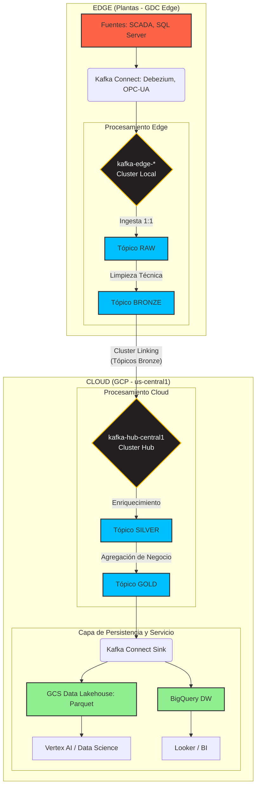

# Arquitectura de Datos v1
**Proyecto**: Migración Industrial a Google Cloud Platform
**Fase**: 2.2 - Diseño Arquitectónico de Datos
**Fecha**: 2025-11-01
**Responsable**: @arquitecto-datos
**Versión**: 1.0

---

## 1. Resumen Ejecutivo

Este documento define la arquitectura de datos para el data hub industrial, construida sobre la plataforma GDC Edge y GCP. El diseño establece un flujo de datos resiliente y desacoplado que captura eventos en el borde (edge), los procesa a través de una **arquitectura Medallion de 4 capas** distribuida entre el borde y la nube, y los sirve para analítica y Machine Learning.

Los principios clave son:
1.  **Procesamiento en el Borde**: Las capas iniciales (RAW, BRONZE) se procesan localmente en los clústeres de GDC Edge para limpiar, filtrar y estandarizar datos en origen, optimizando el ancho de banda y permitiendo la operación autónoma.
2.  **Arquitectura Medallion Distribuida**: Se propone una arquitectura de 4 capas (RAW, BRONZE, SILVER, GOLD) que abarca desde el borde hasta la nube, garantizando la calidad y el gobierno del dato en cada etapa.
3.  **Gobierno de Esquemas Centralizado**: Se utilizará **Confluent Schema Registry** con **Avro** como formato estándar para garantizar la evolución controlada y la compatibilidad de los esquemas de datos.
4.  **Almacenamiento Híbrido (Lakehouse + Data Warehouse)**: Los datos curados se persistirán en un **Data Lakehouse** sobre Google Cloud Storage (GCS) para flexibilidad y casos de uso de IA, y en **BigQuery** como Data Warehouse para analítica de negocio de alto rendimiento.

---

## 2. Flujo de Datos End-to-End

El flujo de datos sigue el principio "Edge-First". La ingesta y el procesamiento inicial ocurren en las plantas, y solo los datos limpios y relevantes son replicados a la nube.

### 2.1. Diagrama de Flujo de Datos (Mermaid)

### 2.2. Descripción del Flujo

1.  **Ingesta (Edge)**: Kafka Connect, corriendo en GDC Edge, captura datos de las fuentes locales. Debezium para CDC de SQL Server y conectores OPC-UA/Modbus para SCADA.
2.  **Capa RAW (Edge)**: Los datos se publican 1 a 1 en tópicos `raw.*` en el Kafka del borde. Esto crea una copia inmutable y persistente del dato original. La retención es corta (ej. 72 horas).
3.  **Capa BRONZE (Edge)**: Un primer proceso de streaming (usando KSQL o Spark en GKE@Edge) consume de los tópicos RAW. Realiza limpieza técnica (ej. corrige tipos de datos, filtra valores nulos) y estandariza el formato a Avro. El resultado se publica en tópicos `bronze.*`.
4.  **Replicación (Edge a Cloud)**: Cluster Linking se configura para replicar **únicamente los tópicos de la capa BRONZE** al clúster `kafka-hub-central1` en GCP. Esto optimiza el uso del Interconnect, enviando solo datos ya validados y estandarizados.
5.  **Capa SILVER (Cloud)**: En la nube, procesos de streaming consumen de los tópicos BRONZE replicados. Aquí se aplica la lógica de negocio: enriquecimiento con otras fuentes, deduplicación, y se conforma un modelo de datos canónico (ej. unificar datos de sensores de diferentes plantas). Se publica en tópicos `silver.*`.
6.  **Capa GOLD (Cloud)**: Se consumen datos de la capa SILVER para crear vistas agregadas y específicas para cada caso de uso de negocio (ej. KPIs de OEE, datasets para modelos de ML, etc.). Se publica en tópicos `gold.*`.
7.  **Persistencia (Cloud)**: Kafka Connect (corriendo en GKE) se usa como un sink para persistir los datos de los tópicos GOLD en GCS (formato Parquet) y BigQuery.
8.  **Servicio (Cloud)**: GCS sirve como un Data Lakehouse para equipos de Data Science (con Vertex AI), mientras que BigQuery actúa como un Data Warehouse de alto rendimiento para BI (con Looker).

---

## 3. Arquitectura Medallion Distribuida

Se propone una arquitectura de 4 capas para asegurar la calidad y el gobierno de los datos a lo largo de su ciclo de vida.

-   **Capa RAW (En el Borde)**
    -   **Propósito**: Ingesta bruta e inmutable. Copia exacta de la fuente.
    -   **Formato**: JSON, texto, binario (tal como viene de la fuente).
    -   **Procesamiento**: Ninguno.
    -   **Retención en Kafka**: 72 horas.

-   **Capa BRONZE (En el Borde)**
    -   **Propósito**: Limpieza técnica y estandarización. Unificar esquemas y tipos de datos.
    -   **Formato**: **Avro**.
    -   **Procesamiento**: Conversión de tipos, renombrado de campos, filtrado de nulos, casteo.
    -   **Retención en Kafka**: 30 días.
    -   **Justificación**: Realizar esta capa en el borde reduce el tráfico a la nube y asegura que solo datos con un formato válido y conocido sean replicados.

-   **Capa SILVER (En la Nube)**
    -   **Propósito**: Modelo de datos de negocio. Enriquecimiento, deduplicación y join entre fuentes.
    -   **Formato**: Avro.
    -   **Procesamiento**: Joins de streams (ej. datos de sensor con datos de producción del ERP), validación de reglas de negocio, deduplicación de señales.
    -   **Retención en Kafka**: 90 días.

-   **Capa GOLD (En la Nube)**
    -   **Propósito**: Agregaciones y vistas para el consumidor final.
    -   **Formato**: Avro.
    -   **Procesamiento**: Agregaciones por ventana de tiempo (ej. OEE por hora), creación de datasets específicos para ML, vistas desnormalizadas para BI.
    -   **Retención en Kafka**: 365 días (para permitir recálculos).

---

## 4. Catálogo de Tópicos de Kafka (Ejemplos)

La nomenclatura de tópicos seguirá el patrón `<entorno>.<capa>.<dominio>.<subdominio>.<detalle>`.

| Nombre del Tópico | Capa | Entorno | Particiones | Retención | Schema | Observaciones |
| :--- | :--- | :--- | :--- | :--- | :--- | :--- |
| `edge.raw.scada.mty.signals` | RAW | Edge | 12 | 72h | JSON | Datos crudos de sensores de Monterrey. | 
| `edge.raw.sql.gdl.orders` | RAW | Edge | 6 | 72h | JSON | Eventos CDC de la tabla de órdenes de GDL. |
| `edge.bronze.telemetry.mty` | BRONZE | Edge | 12 | 30d | Avro | Telemetría limpia y estandarizada de MTY. **Replicado a Cloud**. |
| `edge.bronze.cdc.gdl` | BRONZE | Edge | 6 | 30d | Avro | Eventos CDC limpios de GDL. **Replicado a Cloud**. |
| `cloud.silver.telemetry.unified`| SILVER | Cloud | 24 | 90d | Avro | Visión única de la telemetría de todas las plantas. |
| `cloud.silver.business.orders` | SILVER | Cloud | 12 | 90d | Avro | Órdenes de producción enriquecidas con datos del ERP. |
| `cloud.gold.analytics.oee` | GOLD | Cloud | 6 | 365d | Avro | KPI de OEE (Overall Equipment Effectiveness) agregado por hora. |
| `cloud.gold.ml.features.predictive`| GOLD | Cloud | 6 | 365d | Avro | Features para el modelo de mantenimiento predictivo. |

**Nota sobre Throttling**: Para gestionar los picos de ancho de banda en el Interconnect, ciertos tópicos de baja prioridad serán limitados (throttled) a nivel de replicación en Cluster Linking. Ejemplos de tópicos candidatos a throttling:
- `edge.bronze.logging.apps` (Logs de aplicaciones no críticas)
- `edge.bronze.metrics.infra` (Métricas de infraestructura con menor frecuencia)

---

## 5. Estrategia de Particionamiento y Esquemas

### 5.1. Estrategia de Particionamiento

Una estrategia de particionamiento correcta es clave para el paralelismo y el orden de los eventos.

-   **Clave de Partición**: La clave de partición se definirá jerárquicamente. Para datos de telemetría, la clave será `plant_id:line_id:sensor_id`.
-   **Justificación**:
    1.  **Garantía de Orden**: Todos los mensajes de un mismo sensor irán a la misma partición, garantizando el orden cronológico estricto de sus mediciones, lo cual es un requisito crítico para los sistemas SCADA.
    2.  **Paralelismo**: El procesamiento puede ser paralelizado por planta o por línea de producción, ya que cada una tendrá sus propias particiones.
    3.  **Escalabilidad**: A medida que se añaden nuevas líneas o plantas, el número de particiones puede crecer para acomodar la carga.

### 5.2. Gestión de Esquemas

-   **Herramienta**: Se utilizará **Confluent Schema Registry**, disponible tanto en Confluent Platform (Edge) como en Confluent Cloud. Esto proporciona un único punto de gobierno para todos los esquemas.
-   **Formato de Esquema**: Se estandarizará el uso de **Apache Avro**. 
    -   **Justificación**: Avro es la mejor opción para este caso de uso por su capacidad de evolución de esquemas (hacia adelante y hacia atrás), su serialización binaria compacta (ahorrando espacio en disco y ancho de banda) y su fuerte integración con el ecosistema de Kafka y Hadoop/Spark.
-   **Evolución de Esquemas**: Se configurará Schema Registry con una política de compatibilidad `FORWARD_TRANSITIVE`, permitiendo que los productores evolucionen los esquemas (ej. añadiendo nuevos campos) sin romper los consumidores existentes.

---

## 6. Almacenamiento de Largo Plazo: Lakehouse + Data Warehouse

Se propone una arquitectura de almacenamiento híbrida para combinar la flexibilidad y bajo costo de un Data Lake con el rendimiento de un Data Warehouse.

### 6.1. Google Cloud Storage (GCS) como Data Lakehouse

-   **Propósito**: Almacenamiento de bajo costo, duradero y de formato abierto para los datos de las capas SILVER y GOLD.
-   **Formato**: **Apache Parquet**. Es un formato columnar que ofrece excelente compresión y rendimiento de lectura para cargas de trabajo analíticas.
-   **Particionamiento en GCS**: Los datos se particionarán por fecha (ej. `.../year=2025/month=11/day=01/`) para permitir la poda de particiones (partition pruning) y acelerar las consultas.
-   **Casos de Uso**: Ideal para equipos de Data Science que necesitan acceso a grandes volúmenes de datos para explorar y entrenar modelos con **Vertex AI** y Spark.

### 6.2. Google BigQuery como Data Warehouse

-   **Propósito**: Servir como la capa de consulta de alto rendimiento para Business Intelligence y analítica de negocio.
-   **Ingesta**: Los datos de la capa GOLD de Kafka se cargarán en BigQuery de forma continua utilizando el conector de Kafka Connect para BigQuery o micro-batches con Dataflow.
-   **Modelado**: En BigQuery, los datos se pueden modelar en un esquema de estrella o copo de nieve para optimizar las consultas de los dashboards.
-   **Particionamiento y Clustering**: Las tablas de hechos en BigQuery se particionarán por fecha y se clusterizarán por dimensiones de alta cardinalidad como `plant_id` y `line_id`.
-   **Casos de Uso**: Ideal para dashboards en **Looker**, reportes ejecutivos y consultas ad-hoc de analistas de negocio que requieren respuestas en segundos.

### 6.3. Justificación del Enfoque Híbrido

| Criterio | Data Lakehouse (GCS + Parquet) | Data Warehouse (BigQuery) |
| :--- | :--- | :--- |
| **Costo de Almacenamiento** | ✅ **Muy Bajo** (USD ~0.02/GB-mes) | ⚠️ **Medio** (USD ~0.04/GB-mes activo) |
| **Flexibilidad de Formato** | ✅ **Alta** (formato abierto, Parquet) | ❌ **Baja** (formato propietario optimizado) |
| **Rendimiento de Consultas** | ⚠️ **Medio** (depende de motores como Spark, Presto) | ✅ **Excelente** (motor serverless masivamente paralelo) |
| **Caso de Uso Principal** | Data Science, ML, exploración de datos | Business Intelligence, Reporting, Analítica Interactiva |
| **Ecosistema** | Vertex AI, Spark, Dataproc | Looker, Google Sheets, Ecosistema SQL |

**Conclusión**: Un enfoque híbrido no es redundante, sino que proporciona la herramienta adecuada para cada trabajo, optimizando tanto el costo como el rendimiento y la flexibilidad.

---

## 7. Próximos Pasos

-   **Data Engineer**: Usar este documento como base para diseñar los pipelines de KSQL/Spark específicos para implementar las transformaciones de cada capa (RAW a BRONZE, etc.).
-   **DevSecOps**: Planificar el despliegue y la gestión de Schema Registry como parte de la infraestructura como código.
-   **Arquitecto de Plataforma**: Asegurar que los clústeres GKE en GDC Edge tengan los recursos necesarios para ejecutar los trabajos de streaming de la capa BRONZE.
