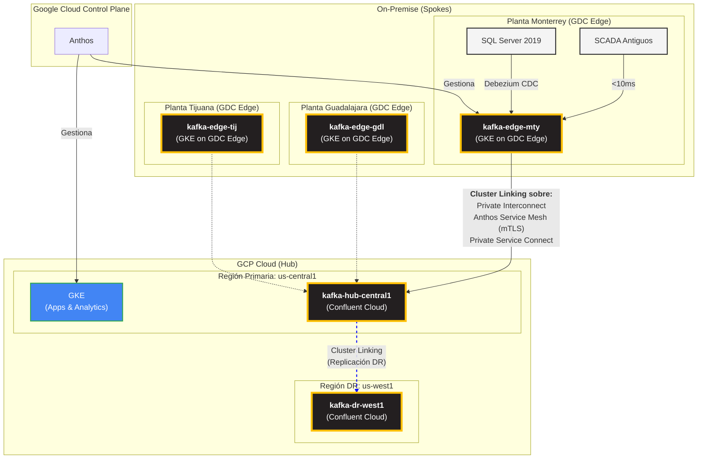

# Arquitectura de Plataforma Distribuida v1 (Revisión GDC Edge)
**Proyecto**: Migración Industrial a Google Cloud Platform
**Fase**: 2.1 - Diseño Arquitectónico de Plataforma
**Fecha**: 2025-11-01
**Responsable**: @arquitecto-plataforma
**Versión**: 1.0 (Pivote a GDC Edge)

---

## 1. Resumen Ejecutivo

Este documento define la arquitectura de plataforma distribuida, reflejando un **pivote estratégico** desde un enfoque multi-proveedor (VMware, Cloudflare) hacia una solución nativa y unificada con **Google Distributed Cloud (GDC) Edge**.

La nueva arquitectura se basa en un modelo **"Edge-First"** para maximizar la resiliencia industrial y la autonomía operativa de las plantas. El procesamiento crítico se realiza localmente en GDC Edge, garantizando que la producción continúe ininterrumpidamente incluso sin conexión a la nube. Los datos se replican de forma asíncrona y priorizada al Hub en GCP para analítica centralizada y DR.

Los componentes clave de este diseño son:
1.  **Plataforma Edge**: Google Distributed Cloud (GDC) Edge con GKE para la ejecución de cargas de trabajo on-premise.
2.  **Plataforma Cloud**: Google Cloud Platform (`us-central1` y `us-west1`).
3.  **Streaming de Eventos**: Confluent Platform, desplegado sobre GKE en GDC Edge y como Confluent Cloud en GCP, utilizando **Cluster Linking** para la replicación.
4.  **Conectividad Privada**: **Google Cloud Interconnect** como capa física, con **Private Service Connect (PSC)** y **Anthos Service Mesh (mTLS)** para una comunicación segura y privada entre servicios.
5.  **Acceso Zero-Trust**: **Identity-Aware Proxy (IAP)** para el acceso seguro de usuarios a las aplicaciones.

**[SUPUESTO CRÍTICO]** Este diseño mantiene el supuesto de que la recomendación del `conectividad-actual.md` para un **upgrade a un Dual Interconnect de 2x1Gbps** es aprobada y ejecutada. Es un requisito indispensable para la replicación de datos.

---

## 2. Principios de Diseño

-   **Operación Autónoma en el Borde (Edge-First)**: Cada planta debe ser capaz de operar de forma 100% autónoma e indefinida si pierde la conexión con la nube central.
-   **Plano de Control Unificado**: Se utilizará **Anthos** como un único plano de control para gestionar clústeres, políticas y seguridad de manera consistente tanto en GDC Edge (on-prem) como en GCP (cloud).
-   **Conectividad Privada por Defecto**: No se expondrán IPs públicas para la comunicación entre la infraestructura de borde y la nube. Todo el tráfico de servicio a servicio se enrutará a través de conexiones privadas y seguras.
-   **Aislamiento de Red por VPC**: Cada clúster o servicio principal (ej. GKE, Cloud SQL) se desplegará en su propia VPC independiente, potencialmente con rangos de IP superpuestos (ej. `10.0.0.0/16`). La comunicación se basará en abstracciones de servicio (PSC, Service Mesh) en lugar de enrutamiento IP, reforzando el desacoplamiento y la seguridad.
-   **Arquitectura Orientada a Eventos (EDA)**: Kafka sigue siendo el sistema nervioso central y la fuente de verdad para todos los eventos de negocio y operativos.
-   **Replicación Asíncrona y Priorizada**: No todos los datos son iguales. La replicación de datos del borde a la nube se clasificará por criticidad para optimizar el uso del ancho de banda.

---

## 3. Justificación de la Arquitectura

El cambio a una pila tecnológica unificada de Google Cloud ofrece ventajas significativas:

-   **Resiliencia Industrial Real**: A diferencia de un modelo dependiente de la nube, GDC Edge está diseñado para la autonomía. La producción no se detiene si el Interconnect falla. El RPO/RTO=0 se logra primero localmente, que es lo más crítico para la operación de la planta.
-   **Gestión Simplificada**: Usar Anthos para gestionar clústeres de GKE en ambas ubicaciones (edge y cloud) reduce drásticamente la complejidad operativa. Un solo equipo puede gestionar toda la infraestructura con un conjunto de herramientas coherente.
-   **Seguridad Nativa y Coherente**: Se reemplaza la dependencia de un tercero (Cloudflare) por los mecanismos de seguridad nativos de GCP. IAP, PSC y Anthos Service Mesh proporcionan un modelo Zero-Trust robusto y unificado, gestionado desde la misma consola y con las mismas políticas de IAM.
-   **FinOps Simplificado**: Todos los costos de infraestructura y servicios (GDC Edge, GKE, Confluent Marketplace, etc.) se consolidan en una única factura de GCP, simplificando el seguimiento, la optimización y el gobierno de costos.
-   **Menor Dependencia Tecnológica**: Se elimina la necesidad de mantener experiencia en stacks de virtualización de VMware y en la plataforma de Cloudflare, permitiendo al equipo especializarse en un único ecosistema.

---

## 4. Topología de Clusters Kafka

La topología Hub-and-Spoke de 5 clusters se mantiene, pero ahora se ejecuta sobre la infraestructura de Google.

| Cluster ID | Ubicación | Plataforma | Rol | Replicación | Retención Datos | Conectado a |
| :--- | :--- | :--- | :--- | :--- | :--- | :--- |
| `kafka-edge-mty` | Planta Monterrey | Confluent (GKE on GDC Edge) | **Spoke / Edge** | 3 réplicas (local) | 7 días | `kafka-hub-central1` |
| `kafka-edge-gdl` | Planta Guadalajara| Confluent (GKE on GDC Edge) | **Spoke / Edge** | 3 réplicas (local) | 7 días | `kafka-hub-central1` |
| `kafka-edge-tij` | Planta Tijuana | Confluent (GKE on GDC Edge) | **Spoke / Edge** | 3 réplicas (local) | 7 días | `kafka-hub-central1` |
| `kafka-hub-central1`| GCP `us-central1` | Confluent Cloud | **Hub Primario** | 3 réplicas (multi-AZ)| 30 días (hot), ∞ (cold)| `kafka-dr-west1` |
| `kafka-dr-west1` | GCP `us-west1` | Confluent Cloud | **Hub DR** | 3 réplicas (multi-AZ)| 30 días (hot), ∞ (cold)| N/A |

---

## 5. Diagrama de Arquitectura de Plataforma (Mermaid)

---

## 6. Estrategia de Conectividad y Resiliencia

### 6.1. Resiliencia "Edge-First"

El pilar de la resiliencia es que **la operación de la planta no depende de la nube**. 
- **RPO/RTO=0 Local**: Los sistemas críticos (SCADA, MES) interactúan exclusivamente con el clúster GKE local en GDC Edge. Si el Interconnect se corta, la planta sigue funcionando sin ninguna degradación. El RPO/RTO=0 se cumple dentro del entorno de la planta.
- **Replicación Asíncrona**: Los datos se replican a la nube de forma asíncrona para análisis y archivado. Una caída de la WAN solo retrasa la llegada de datos al hub central, no detiene la producción.

### 6.2. Conectividad Privada y Segura

Se establece una comunicación de servicio a servicio totalmente privada y segura, sin exponer nada a la red pública.

-   **Google Cloud Interconnect (Dual 2x1Gbps)**: Provee la capa física de conectividad privada y de alto ancho de banda entre las plantas y las regiones de GCP.
-   **Private Service Connect (PSC)**: Expone el servicio de Confluent Cloud (en la VPC de Confluent) como un endpoint privado dentro de la VPC del proyecto. Los clústeres GKE en GDC Edge se conectan a este endpoint sin necesidad de IPs públicas ni peering.
-   **Anthos Service Mesh**: Proporciona una capa de servicio gestionada que ofrece:
    -   **mTLS Automático**: Todo el tráfico entre los clústeres Kafka (ej. Cluster Linking) está encriptado y autenticado de extremo a extremo, garantizando que solo servicios autorizados puedan comunicarse.
    -   **Visibilidad y Control**: Permite tener telemetría detallada del tráfico y aplicar políticas de red granulares.

### 6.3. Acceso de Usuario Zero-Trust

-   **Identity-Aware Proxy (IAP)**: Para el acceso de operadores, desarrolladores o analistas a las aplicaciones (ej. dashboards, UIs de gestión), se usará IAP. Este servicio actúa como un proxy de autenticación que valida la identidad del usuario y el contexto del dispositivo antes de permitir el acceso, eliminando la necesidad de VPNs de cliente.

---

## 7. Supuestos y Próximos Pasos

### Supuestos Clave
-   **Conectividad**: Se APRUEBA el upgrade a **Dual Interconnect 2x1Gbps**.
-   **GDC Edge**: Se asume que el hardware y la infraestructura de red en las plantas cumplen los requisitos para la instalación de GDC Edge.
-   **Licenciamiento**: El costo de GDC Edge, Anthos y Confluent Platform se ajusta al modelo financiero y se gestiona de forma centralizada.

### Próximos Pasos
-   **Arquitecto de Datos**: Proceder con el diseño del catálogo de tópicos Kafka y las capas de datos (medallion), considerando que ahora existe una clara separación entre los datos en el borde y en la nube.
-   **Experto en Redes**: Validar el diseño de PSC y las políticas de Anthos Service Mesh para el tráfico de Cluster Linking.
-   **DevSecOps**: Diseñar las políticas de IAM y IAP para el acceso Zero-Trust.
