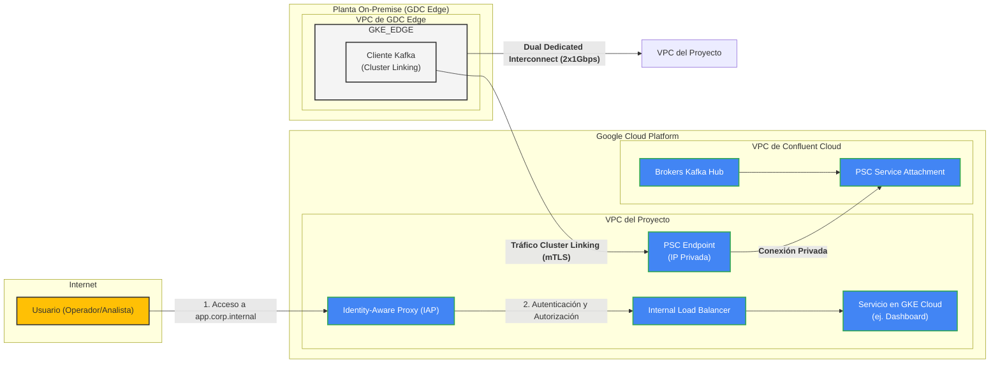

# Arquitectura de Red y Seguridad Nativa GCP v1
**Proyecto**: Migración Industrial a Google Cloud Platform
**Fase**: 2.3 - Diseño Arquitectónico de Red
**Fecha**: 2025-11-01
**Responsable**: @experto-redes
**Versión**: 1.0

---

## 1. Resumen Ejecutivo

Este documento detalla la arquitectura de red y seguridad para la plataforma unificada sobre Google Cloud y GDC Edge. El diseño implementa un modelo **100% privado y nativo de GCP**, que no expone servicios de infraestructura a internet y se basa en un paradigma **Zero-Trust** para todos los accesos.

Los pilares de este diseño son:
1.  **Conectividad Física Redundante**: Se ratifica la necesidad de un **Dual Dedicated Interconnect (2x1Gbps)** para garantizar la capacidad y alta disponibilidad del enlace entre las plantas y GCP.
2.  **Comunicación de Servicios Privada**: Se utilizará **Private Service Connect (PSC)** para consumir servicios (como Confluent Cloud) de forma privada entre distintas VPCs, eliminando la necesidad de peering o IPs públicas.
3.  **Seguridad y Cifrado End-to-End**: **Anthos Service Mesh** proporcionará cifrado mTLS automático para todo el tráfico de servicio a servicio (ej. Kafka Cluster Linking) entre el borde y la nube.
4.  **Acceso de Usuario Zero-Trust**: **Identity-Aware Proxy (IAP)** asegurará el acceso de los usuarios a las aplicaciones, basándose en la identidad y el contexto, eliminando por completo la necesidad de VPNs de cliente.

Esta arquitectura es inherentemente más segura, resiliente y operativamente más simple al consolidar toda la gestión dentro del ecosistema de Google Cloud.

---

## 2. Arquitectura de Conectividad Privada

El objetivo es crear un "puente" de red transparente, privado y seguro entre los clústeres GKE en GDC Edge y los servicios en las regiones de GCP.

### 2.1. Capa Física: Dual Dedicated Interconnect

-   **Recomendación**: Como se estableció en `conectividad-actual.md`, es **crítico** hacer un upgrade del Interconnect actual de 1Gbps a una topología **Dual Dedicated Interconnect de 2x1Gbps**.
-   **Justificación**:
    -   **Capacidad**: Provee 2Gbps de ancho de banda agregado, necesario para soportar el tráfico de replicación de Kafka Cluster Linking (estimado en 865 Mbps promedio, con picos de ~2.2 Gbps que pueden ser gestionados con QoS y compresión).
    -   **Redundancia y HA**: Ofrece una topología activa-activa con una disponibilidad del 99.99%. Si un enlace falla, el otro sigue operativo con 1Gbps de capacidad, suficiente para el tráfico crítico, garantizando así el cumplimiento del RPO.
-   **Configuración**: Se configurará BGP con ECMP (Equal-Cost Multi-Path) para balancear el tráfico entre los dos enlaces.

### 2.2. Conectividad de Servicio: Private Service Connect (PSC)

-   **Caso de Uso**: Conectar de forma privada los GKE en GDC Edge con el servicio de Confluent Cloud en GCP.
-   **Funcionamiento**:
    1.  **Publicación del Servicio**: Confluent Cloud publica su servicio (los brokers de Kafka) a través de un "Service Attachment" de PSC.
    2.  **Consumo del Servicio**: En la VPC del proyecto (tanto en la región `us-central1` como en las VPCs de GDC Edge), se crea un "Endpoint" de PSC que apunta a dicho Service Attachment.
    3.  **Resultado**: El clúster de Confluent Cloud aparece como una IP interna dentro de la red del proyecto. Toda la comunicación ocurre dentro de la red troncal de Google, sin tocar la internet pública.
-   **Ventajas**:
    -   **Sin solapamiento de IPs (IP Overlap)**: A diferencia del Peering de VPC, no importa si los rangos de IP de la VPC de Confluent y la del proyecto se solapan.
    -   **Seguridad**: El tráfico es unidireccional y no se abren reglas de firewall generales.
    -   **Simplicidad**: No requiere gestión de rutas complejas.

### 2.3. Malla de Servicios: Anthos Service Mesh (ASM)

-   **Propósito**: Proporcionar una capa de red inteligente y segura sobre la conectividad física y de servicio.
-   **Componentes**: ASM se instalará en todos los clústeres de GKE (tanto en GDC Edge como en GCP).
-   **Funcionalidades Clave**:
    1.  **mTLS Automático**: Todo el tráfico entre pods (ej. entre el cliente de Cluster Linking en el GKE@Edge y el bróker de Kafka expuesto por PSC) será cifrado y autenticado mutuamente de forma automática.
    2.  **Observabilidad**: ASM proporciona telemetría detallada (latencias, tasas de error, volumen de tráfico) para cada servicio, visible de forma unificada en la consola de GCP.
    3.  **Control de Tráfico**: Permite políticas de tráfico avanzadas, como reintentos automáticos, timeouts y circuit breakers, que aumentan la resiliencia de la comunicación.

--- 

## 3. Arquitectura de Acceso de Usuario Zero-Trust

Se elimina por completo la necesidad de VPNs de cliente para el acceso de usuarios a las aplicaciones internas.

-   **Componente Central**: **Identity-Aware Proxy (IAP)**.
-   **Flujo de Acceso**:
    1.  Un usuario intenta acceder a una URL de una aplicación interna (ej. `dashboard.corp.internal`).
    2.  El Google Cloud Load Balancer intercepta la petición y la redirige a IAP.
    3.  IAP redirige al usuario a la página de inicio de sesión de Google.
    4.  El usuario se autentica con sus credenciales corporativas (federadas con el IdP existente vía SAML/OIDC en Google Identity Platform).
    5.  Una vez autenticado, IAP evalúa las políticas de acceso de IAM: ¿Pertenece este usuario al grupo correcto? ¿Accede desde una ubicación permitida? ¿Su dispositivo cumple las políticas de seguridad?
    6.  Si todas las condiciones se cumplen, IAP permite el paso del tráfico hacia la aplicación. En ningún momento el usuario tiene acceso directo a la red de la VPC.
-   **Ventajas**:
    -   **Seguridad Mejorada**: El acceso se basa en la identidad del usuario y el contexto, no en la ubicación de red.
    -   **Experiencia de Usuario Simplificada**: Sin necesidad de instalar y conectar un cliente VPN.
    -   **Auditoría Centralizada**: Todos los intentos de acceso se registran en Cloud Audit Logs.

---

## 4. Estrategia Multi-VPC y Prioridad de Comunicación

Para maximizar el desacoplamiento y la seguridad, la arquitectura adopta un modelo donde los servicios no se comunican directamente por IP, sino a través de abstracciones de servicio.

### 4.1. Aislamiento con VPCs Independientes
- **Principio**: Cada componente principal (ej. el clúster GKE de una planta, un entorno de Cloud SQL) se desplegará en su propia VPC.
- **Redes Superpuestas**: Es aceptable y esperado que estas VPCs usen rangos de IP superpuestos (ej. todas pueden usar `10.0.0.0/16`). Esto es posible porque no existirá enrutamiento directo entre ellas.
- **Beneficio**: Elimina por completo la necesidad de una gestión centralizada de direccionamiento IP (IPAM), simplificando la expansión y evitando conflictos de red.

### 4.2. Prioridad de Comunicación Inter-Servicio
Se establece un orden de preferencia para la comunicación entre servicios desplegados en VPCs distintas:

1.  **Nivel 1: Comunicación Asíncrona vía Kafka (Máxima Prioridad)**
    -   **Cuándo usarlo**: Para la mayoría de las interacciones entre dominios de negocio. Es el modo de comunicación por defecto.
    -   **Mecanismo**: Un servicio produce un evento a un tópico de Kafka. Otro servicio consume de ese tópico.
    -   **Conexión**: Se realiza a través de **Private Service Connect** para acceder al bróker de Kafka de forma privada.
    -   **Ventaja**: Máximo desacoplamiento y resiliencia. El servicio consumidor no necesita saber dónde vive el productor, y puede procesar eventos incluso si el productor está temporalmente caído.

2.  **Nivel 2: Malla de Servicios (Anthos Service Mesh)**
    -   **Cuándo usarlo**: Para comunicación síncrona (request/response) donde se requiere baja latencia y control de tráfico avanzado.
    -   **Mecanismo**: Un servicio llama a otro directamente por su nombre de servicio de Kubernetes (ej. `http://orders.default.svc.cluster.local`).
    -   **Conexión**: Anthos Service Mesh gestiona el descubrimiento de servicios y enruta el tráfico de forma segura con mTLS a través del Interconnect.
    -   **Ventaja**: Cifrado, autenticación, observabilidad y control de tráfico (reintentos, circuit breakers) automáticos.

3.  **Nivel 3: PSC Directo**
    -   **Cuándo usarlo**: Para exponer un servicio específico (que no es Kafka) que necesita ser consumido por múltiples VPCs de forma privada.
    -   **Mecanismo**: Similar a como se expone Kafka, el servicio se publica con un "Service Attachment" y se consume con un "Endpoint".
    -   **Ventaja**: Conexión privada y segura sin la sobrecarga de una malla de servicios completa si no se necesita.

4.  **Nivel 4: Gateway de APIs (Apigee)**
    -   **Cuándo usarlo**: Para exponer servicios como APIs gestionadas, aplicando políticas de seguridad, cuotas y transformación.
    -   **Mecanismo**: Un servicio interno se expone a través de un proxy de Apigee.
    -   **Ventaja**: Ideal para exponer funcionalidades a otros equipos de forma controlada o para futuras integraciones con terceros. Es la capa de abstracción más alta.

## 4. Estrategia Multi-VPC y Prioridad de Comunicación

Para maximizar el desacoplamiento y la seguridad, la arquitectura adopta un modelo donde los servicios no se comunican directamente por IP, sino a través de abstracciones de servicio.

### 4.1. Aislamiento con VPCs Independientes
- **Principio**: Cada componente principal (ej. el clúster GKE de una planta, un entorno de Cloud SQL) se desplegará en su propia VPC.
- **Redes Superpuestas**: Es aceptable y esperado que estas VPCs usen rangos de IP superpuestos (ej. todas pueden usar `10.0.0.0/16`). Esto es posible porque no existirá enrutamiento directo entre ellas.
- **Beneficio**: Elimina por completo la necesidad de una gestión centralizada de direccionamiento IP (IPAM), simplificando la expansión y evitando conflictos de red.

### 4.2. Prioridad de Comunicación Inter-Servicio
Se establece un orden de preferencia para la comunicación entre servicios desplegados en VPCs distintas:

1.  **Nivel 1: Comunicación Asíncrona vía Kafka (Máxima Prioridad)**
    -   **Cuándo usarlo**: Para la mayoría de las interacciones entre dominios de negocio. Es el modo de comunicación por defecto.
    -   **Mecanismo**: Un servicio produce un evento a un tópico de Kafka. Otro servicio consume de ese tópico.
    -   **Conexión**: Se realiza a través de **Private Service Connect** para acceder al bróker de Kafka de forma privada.
    -   **Ventaja**: Máximo desacoplamiento y resiliencia. El servicio consumidor no necesita saber dónde vive el productor, y puede procesar eventos incluso si el productor está temporalmente caído.

2.  **Nivel 2: Malla de Servicios (Anthos Service Mesh)**
    -   **Cuándo usarlo**: Para comunicación síncrona (request/response) donde se requiere baja latencia y control de tráfico avanzado.
    -   **Mecanismo**: Un servicio llama a otro directamente por su nombre de servicio de Kubernetes (ej. `http://orders.default.svc.cluster.local`).
    -   **Conexión**: Anthos Service Mesh gestiona el descubrimiento de servicios y enruta el tráfico de forma segura con mTLS a través del Interconnect.
    -   **Ventaja**: Cifrado, autenticación, observabilidad y control de tráfico (reintentos, circuit breakers) automáticos.

3.  **Nivel 3: PSC Directo**
    -   **Cuándo usarlo**: Para exponer un servicio específico (que no es Kafka) que necesita ser consumido por múltiples VPCs de forma privada.
    -   **Mecanismo**: Similar a como se expone Kafka, el servicio se publica con un "Service Attachment" y se consume con un "Endpoint".
    -   **Ventaja**: Conexión privada y segura sin la sobrecarga de una malla de servicios completa si no se necesita.

4.  **Nivel 4: Gateway de APIs (Apigee)**
    -   **Cuándo usarlo**: Para exponer servicios como APIs gestionadas, aplicando políticas de seguridad, cuotas y transformación.
    -   **Mecanismo**: Un servicio interno se expone a través de un proxy de Apigee.
    -   **Ventaja**: Ideal para exponer funcionalidades a otros equipos de forma controlada o para futuras integraciones con terceros. Es la capa de abstracción más alta.
## 4. Diagrama de Red Detallado (Mermaid)

Este diagrama ilustra cómo los componentes de red y seguridad interactúan.



---

## 5. Políticas de Red (Ejemplos)

Para asegurar la micro-segmentación y el principio de mínimo privilegio dentro de los clústeres de GKE, se usarán `NetworkPolicy` de Kubernetes.

**Ejemplo 1: Aislar un Namespace por Defecto**

Esta política, aplicada a un namespace, deniega todo el tráfico de entrada y salida por defecto, forzando a definir reglas explícitas para cada comunicación necesaria.

```yaml
apiVersion: networking.k8s.io/v1
kind: NetworkPolicy
metadata:
  name: default-deny-all
  namespace: kafka-edge
spec:
  podSelector: {}
  policyTypes:
  - Ingress
  - Egress
```

**Ejemplo 2: Permitir Conexión de Debezium a Kafka en el Borde**

Esta política permitiría a los pods de Debezium (con la etiqueta `app: debezium`) en el namespace `connectors` conectarse a los brokers de Kafka (con la etiqueta `app: kafka`) en el namespace `kafka-edge` en el puerto 9092.

```yaml
apiVersion: networking.k8s.io/v1
kind: NetworkPolicy
metadata:
  name: allow-debezium-to-kafka
  namespace: kafka-edge
spec:
  podSelector:
    matchLabels:
      app: kafka
  ingress:
  - from:
    - namespaceSelector:
        matchLabels:
          name: connectors
      podSelector:
        matchLabels:
          app: debezium
    ports:
    - protocol: TCP
      port: 9092
```

---

## 6. Próximos Pasos

-   **DevSecOps**: Utilizar este diseño para crear las políticas de IAM para IAP y las `NetworkPolicy` como código, gestionadas a través de Anthos Config Management.
-   **Admin Sistemas Legados**: Preparar los segmentos de red on-premise para la instalación del hardware de GDC Edge y la conexión con el Interconnect.
-   **Finanzas**: Revisar los costos asociados a PSC, Anthos y el egreso de datos a través del Interconnect para refinar el modelo financiero.
