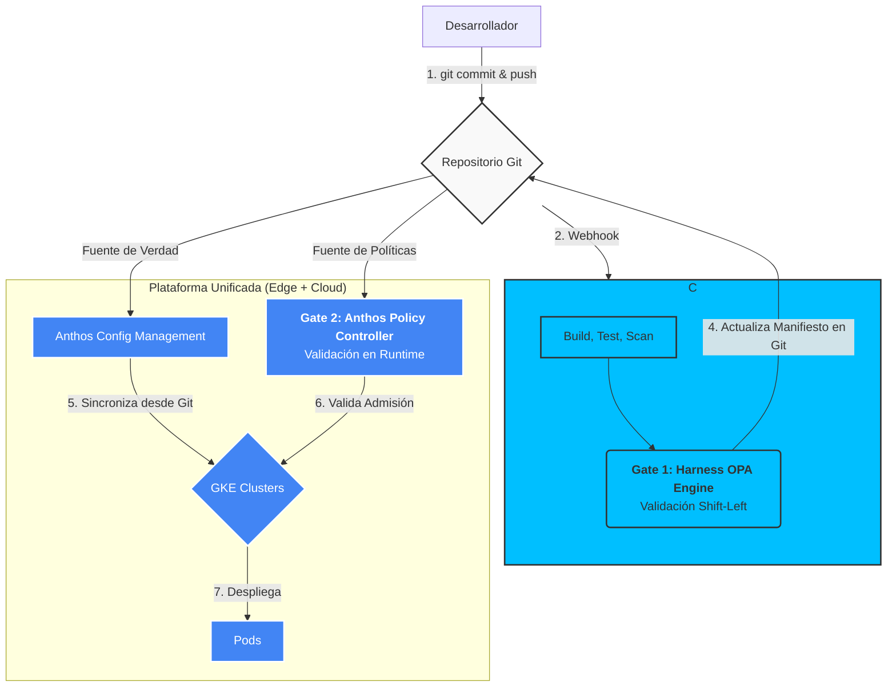

# Modelo de Gobierno, Seguridad y GitOps (OPA-centric) v1
**Proyecto**: Migración Industrial a Google Cloud Platform
**Fase**: 3.2 - Diseño de DevSecOps y Gobierno
**Fecha**: 2025-11-01
**Responsable**: @devsecops
**Versión**: 1.0

---

## 1. Resumen Ejecutivo

Este documento define un modelo de gobierno y operaciones unificado para la plataforma híbrida (GDC Edge y GCP), basado en dos principios fundamentales e innegociables:

1.  **Todo como Código (Everything as Code)**: Cada aspecto de la plataforma —infraestructura, redes, políticas, aplicaciones, seguridad y costos— será definido de forma declarativa en repositorios Git. Git es la única fuente de verdad.
2.  **Gobierno Basado en Políticas (Policy-as-Code)**: **Open Policy Agent (OPA)** es el motor de gobierno centralizado. Se implementa en una estrategia de **defensa en profundidad de dos etapas** para una máxima seguridad y control.

El flujo de trabajo se orquesta mediante **Harness** para CI/CD y **Anthos Config Management** para el despliegue continuo (GitOps), creando un sistema seguro, auditable y altamente automatizado que abarca desde el borde hasta la nube.

---

## 2. Arquitectura GitOps y Doble Validación de Políticas

El ciclo de vida de cualquier cambio seguirá un flujo GitOps estricto con dos puntos de control de políticas.

### 2.1. Diagrama de Flujo GitOps con Defensa en Profundidad



### 2.2. Estrategia de Doble Validación (Defensa en Profundidad)

Utilizamos OPA en dos etapas distintas para una cobertura completa:

-   **Gate 1: Validación Shift-Left en el Pipeline (Harness)**
    -   **Cuándo**: Durante la ejecución del pipeline de CI/CD, antes de que cualquier artefacto se fusione al branch principal o se promueva.
    -   **Motor**: **Harness Policy Engine (basado en OPA)**.
    -   **Función**: Analiza los manifiestos de Kubernetes como código. Su objetivo es proporcionar **feedback inmediato** al desarrollador. Si una política se viola, el pipeline falla y el desarrollador sabe que debe corregir su código antes de continuar. Previene que el código inválido llegue al repositorio principal.

-   **Gate 2: Validación en Runtime en el Clúster (Anthos)**
    -   **Cuándo**: En el momento en que se intenta aplicar una configuración al API Server de Kubernetes.
    -   **Motor**: **Anthos Policy Controller (basado en OPA Gatekeeper)**.
    -   **Función**: Actúa como el **guardián final y autoritativo** del clúster. Rechaza cualquier configuración que viole las políticas, sin importar el origen (un pipeline de GitOps, un `kubectl apply` manual de un administrador, etc.). Garantiza que el estado del clúster siempre sea compliant.

### 2.3. Pipeline CI/CD Unificado para ksqlDB y Spark

Para gestionar la complejidad de tener dos motores de procesamiento de streaming, se creará una plantilla de pipeline CI/CD unificada en Harness que maneje ambos casos:

-   **Para ksqlDB**: El pipeline se enfocará en un flujo de "Policy as Code". Los cambios en los archivos `.sql` de ksqlDB serán versionados en Git. El pipeline de Harness tratará estos scripts como artefactos de configuración y los aplicará al clúster de ksqlDB correspondiente a través de su API REST, gestionado por Anthos Config Management.
-   **Para Spark**: El pipeline seguirá un flujo más tradicional de CI. Compilará el código fuente de Spark (Scala/Java/Python), lo empaquetará en una imagen de contenedor, subirá la imagen a Google Artifact Registry, y finalmente actualizará el manifiesto del `SparkApplication` o `Job` de Kubernetes en el repositorio Git, lo que activará el despliegue vía GitOps.

---

## 3. Gobierno Unificado con Open Policy Agent (OPA)

Todas las políticas se escriben en lenguaje **Rego**, se versionan en un repositorio Git dedicado y se aplican a través de los dos motores OPA.

### 3.1. Control de Seguridad como Código
-   **Ejemplo (Rego)**: No permitir contenedores que corran como `root`.
    ```rego
    package k8s.security

    violation[{"msg": msg}] {
        input.review.object.spec.securityContext.runAsNonRoot == false
        msg := "Los contenedores no deben correr como root. Establecer securityContext.runAsNonRoot a true."
    }
    ```

### 3.2. Control de Red como Código
-   **Ejemplo (Rego)**: Forzar que todos los servicios expuestos vía Ingress estén protegidos por IAP.
    ```rego
    package k8s.network

    violation[{"msg": msg}] {
        input.review.object.kind == "Ingress"
        not input.review.object.metadata.annotations["ingress.gcp.kubernetes.io/pre-shared-cert"]
        msg := "Todo Ingress debe estar protegido por IAP. Falta la anotación de certificado de IAP."
    }
    ```

### 3.3. Control de FinOps como Código
-   **Ejemplo (Rego)**: Limitar las solicitudes de CPU y memoria para evitar sobrecostos.
    ```rego
    package k8s.finops

    violation[{"msg": msg}] {
        c := input.review.object.spec.containers[_]
        c.resources.requests.cpu > "2000m"
        msg := sprintf("La solicitud de CPU (%v) excede el límite de 2 cores.", [c.resources.requests.cpu])
    }

    violation[{"msg": msg}] {
        c := input.review.object.spec.containers[_]
        c.resources.requests.memory > "4Gi"
        msg := sprintf("La solicitud de memoria (%v) excede el límite de 4Gi.", [c.resources.requests.memory])
    }
    ```

---

## 4. Plan de Seguridad Detallado

-   **IAM (Identity and Access Management)**: Se definirán roles personalizados de mínimo privilegio en GCP (ej. `roles/gkeDeveloper`, `roles/dataPipelineOperator`) y se asociarán a grupos. Los usuarios nunca recibirán permisos directamente.
-   **Gestión de Secretos**: Todos los secretos (contraseñas, API keys, certificados) serán almacenados en **Google Secret Manager**. Las aplicaciones en GKE accederán a ellos de forma segura utilizando el **Secrets Store CSI Driver**, que monta los secretos como archivos en el pod, evitando su exposición en variables de entorno o manifiestos.
    -   **Nota sobre Rotación de Secretos**: Para los pipelines de streaming de larga duración, la rotación de secretos se gestionará con un patrón de **sidecar**. Un pequeño contenedor sidecar se ejecutará junto al pod principal del pipeline y su única función será observar cambios en el secreto montado y señalar al proceso principal para que recargue su configuración sin necesidad de un reinicio completo, asegurando la continuidad del procesamiento.
-   **VPC Service Controls**: Se creará un perímetro de servicio alrededor de los proyectos de GCP que contienen datos sensibles (ej. el proyecto del Data Lakehouse). Este perímetro previene la exfiltración de datos, bloqueando la copia de datos a buckets públicos o a servicios fuera del perímetro.
-   **Seguridad de la Cadena de Suministro de Software**: Se utilizará **Binary Authorization** para asegurar que solo imágenes de contenedor firmadas y verificadas (que hayan pasado todos los escaneos de seguridad en el pipeline de Harness) puedan ser desplegadas en los clústeres GKE.

---

## 5. Plan FinOps 30-60-90 Días

-   **Primeros 30 Días: Visibilidad**
    1.  **Implementar Políticas de Etiquetado**: Desplegar políticas OPA que exijan las etiquetas `owner`, `cost_center`, y `application` en todos los recursos.
    2.  **Configurar Presupuestos y Alertas**: Crear presupuestos en GCP para cada proyecto y configurar alertas que notifiquen a los dueños de los costos cuando se alcance el 50%, 80% y 100% del presupuesto.
    3.  **Activar Exportación de Facturación**: Configurar la exportación diaria de los datos de facturación de GCP a una tabla de BigQuery para análisis detallado.

-   **Primeros 60 Días: Optimización**
    1.  **Desplegar KubeCost**: Instalar KubeCost en los clústeres para obtener una visión detallada del costo por namespace, deployment, etc.
    2.  **Crear Dashboards de Showback**: En Looker, crear dashboards que muestren a cada equipo su consumo de recursos y costos asociados, basados en las etiquetas.
    3.  **Identificar Quick Wins**: Analizar las recomendaciones de GCP (Recommender API) para identificar VMs sobredimensionadas o discos no utilizados.

-   **Primeros 90 Días: Automatización**
    1.  **Automatizar Right-Sizing**: Implementar pipelines que utilicen las recomendaciones de la Recommender API para sugerir automáticamente cambios de tamaño en las declaraciones de recursos en Git (Pull Requests).
    2.  **Política de Terminación de Recursos Ociosos**: Crear y aplicar políticas automatizadas para identificar y dar de baja recursos huérfanos (discos no adjuntos, IPs no asignadas) después de un período de gracia.

---

## 6. Próximos Pasos

-   **Data Engineer**: Colaborar para asegurar que los pipelines de datos puedan ser desplegados y gestionados a través del flujo GitOps.
-   **Admin Sistemas Legados**: Preparar los repositorios Git iniciales para la configuración de la infraestructura de GDC Edge.
-   **Arquitecto de Plataforma**: Definir la estructura de repositorios Git que contendrá la configuración de la plataforma como código.