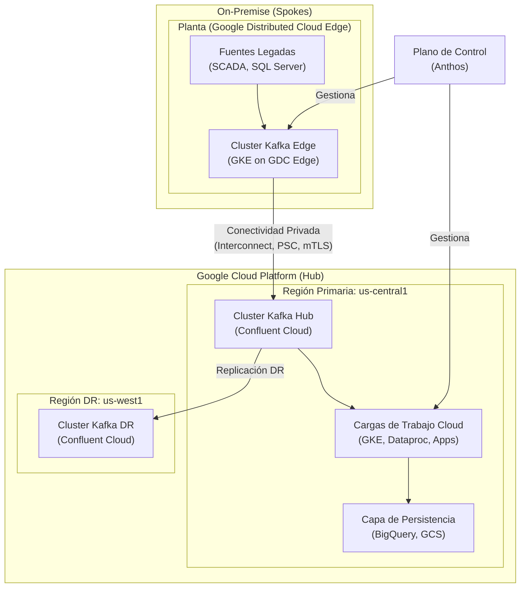
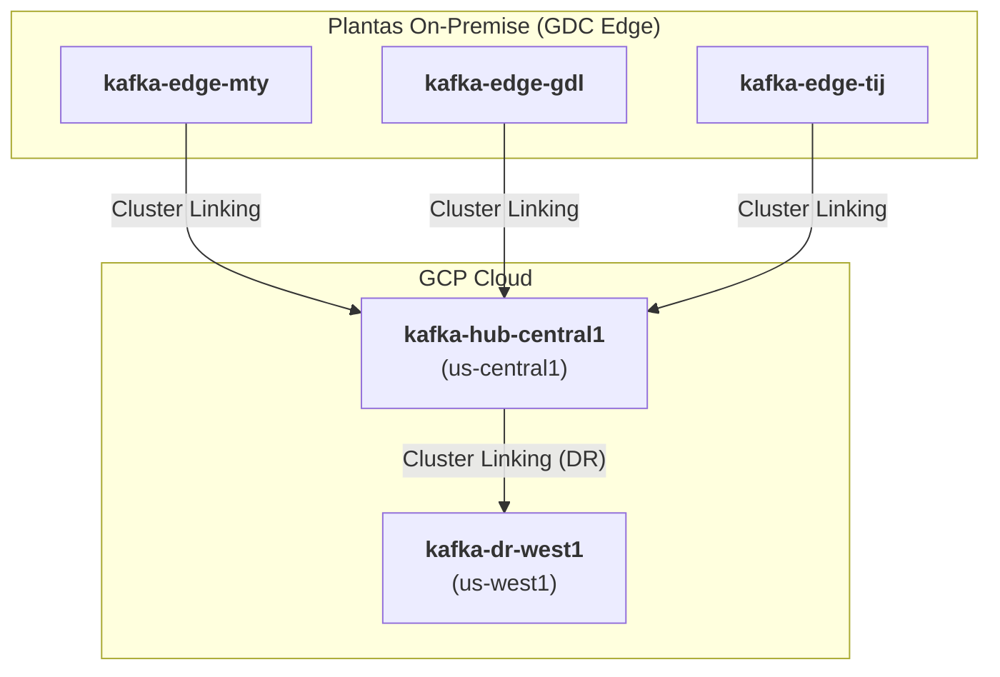
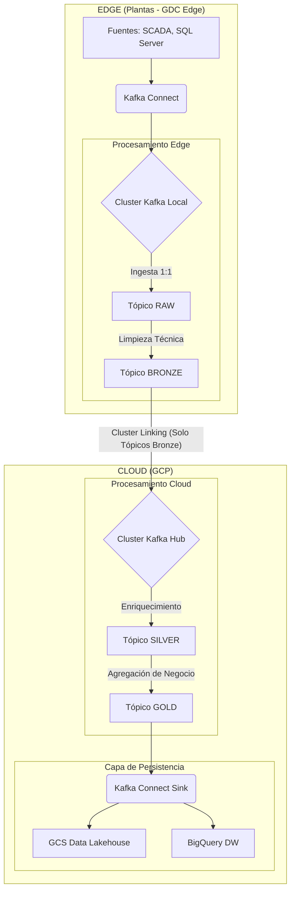
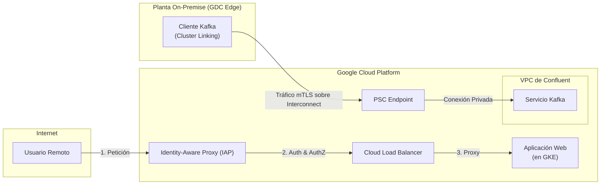
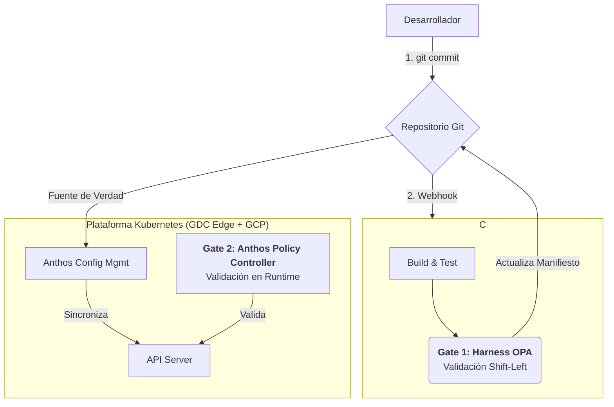

# Diagramas Consolidados de Arquitectura
**Proyecto**: Migración Industrial a Google Cloud Platform
**Fase**: 6.2 - Consolidación de Diagramas
**Fecha**: 2025-11-01
**Responsable**: @arquitecto-plataforma

---

## 1. Arquitectura de Alto Nivel (End-to-End)

Este diagrama muestra la visión completa de la plataforma, desde el borde on-premise hasta la nube, incluyendo el plano de control unificado con Anthos.



---

## 2. Topología Kafka y Replicación

Este diagrama detalla la topología de 5 clústeres de Kafka y cómo se utiliza Cluster Linking para la replicación desde el borde a la nube y para la recuperación ante desastres.



---

## 3. Flujo de Datos (Arquitectura Medallion)

Este diagrama muestra el flujo de datos a través de las 4 capas de la arquitectura Medallion, desde la ingesta en crudo en el borde hasta las agregaciones de negocio en la nube.



---

## 4. Arquitectura de Red y Seguridad (Zero-Trust)

Este diagrama detalla el flujo de comunicación privada para servicios (PSC) y para usuarios (IAP), mostrando el modelo de seguridad Zero-Trust.



---

## 5. Flujo de Trabajo GitOps

Este diagrama ilustra el flujo de CI/CD "Todo como Código", mostrando los dos puntos de validación de políticas con OPA.



---

## 6. Arquitectura MLOps

Este diagrama muestra el ciclo de vida para el re-entrenamiento y despliegue automático de los modelos de IA para FinOps usando Vertex AI.

```mermaid
graph TD
    A[Cloud Scheduler] --> B(Cloud Function)
    B -- "Dispara Pipeline" --> C[Vertex AI Pipelines]
    
    subgraph C
        C1[Cargar Datos<br/>(desde BigQuery)] --> C2[Entrenar Modelo]
        C2 --> C3[Evaluar Modelo]
        C3 -- Si es bueno --> C4[Registrar en Model Registry]
    end

    C4 --> D[Desplegar en Endpoint]
```

---

## 7. Dashboard de FinOps (Conceptual)

Este diagrama conceptual muestra las fuentes de datos y los KPIs clave que se visualizarían en el dashboard de FinOps en Looker.

```mermaid
graph TD
    subgraph "Fuentes de Datos"
        A[BigQuery<br/>(Datos de Facturación GCP)]
        B[KubeCost<br/>(Costos por Pod/Namespace)]
        C[Hojas de Cálculo<br/>(Presupuestos, Metas)]
    end

    subgraph "Dashboard FinOps en Looker"
        D[KPIs Clave]
        D1["TCO (Cloud vs On-Prem)"]
        D2["ROI y Payback"]
        D3["Costo por Unidad Producida"]
        D4["Forecast vs. Real"]
        D5["Anomalías de Costo"]
        D6["Cumplimiento de Etiquetado"]
    end

    A --> D
    B --> D
    C --> D
```
