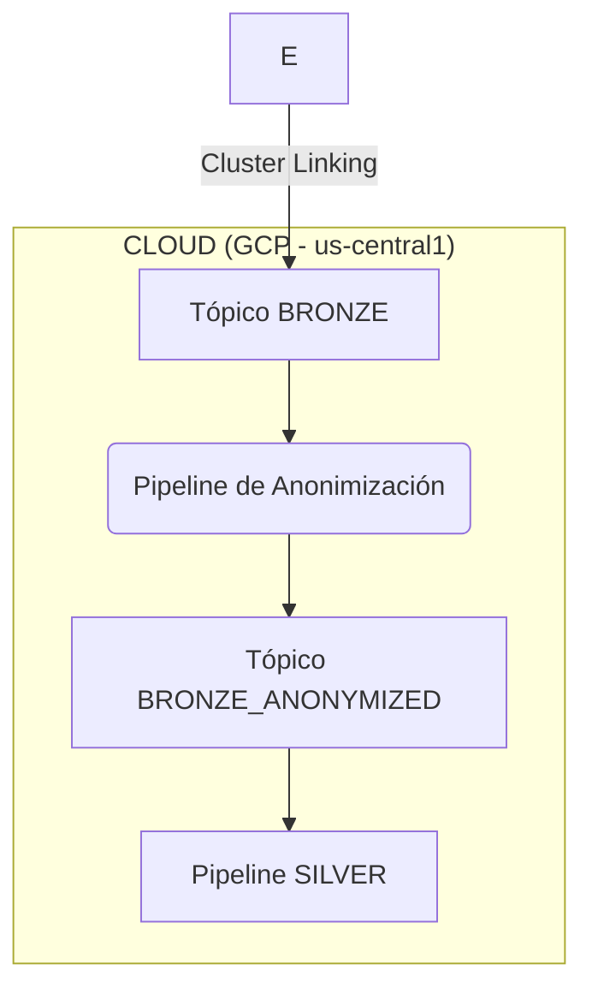

# Diseño de Pipelines de Datos v1
**Proyecto**: Migración Industrial a Google Cloud Platform
**Fase**: 3.1 - Diseño de Pipelines de Datos
**Fecha**: 2025-11-01
**Responsable**: @data-engineer
**Versión**: 1.0

---

## 1. Resumen Ejecutivo

Este documento detalla el diseño de los pipelines de datos para implementar la arquitectura Medallion distribuida. El enfoque se centra en utilizar la herramienta adecuada para cada tarea, aprovechando la capacidad de cómputo tanto en el borde (GDC Edge) como en la nube (GCP).

Los puntos clave del diseño son:
1.  **Procesamiento Híbrido**: Se utilizará **ksqlDB en GDC Edge** para las transformaciones ligeras y de baja latencia (RAW a BRONZE), y **Spark en Dataproc sobre GKE** en la nube para las transformaciones complejas y con estado (BRONZE a SILVER/GOLD).
2.  **Flexibilidad Medallion**: El modelo de 4 capas es una base. Se demuestra cómo se pueden añadir capas intermedias (ej. para anonimización) para cumplir requisitos específicos sin alterar el flujo principal.
3.  **Respaldo de Datos Crudos**: Se diseña un pipeline de **baja prioridad** utilizando un conector GCS Sink en el borde para respaldar de forma asíncrona y económica los datos RAW directamente a Google Cloud Storage, sin impactar la replicación de datos críticos.
4.  **Manejo de Datos Tardíos**: Se establece una estrategia de "watermarking" en los pipelines de Spark para manejar correctamente los eventos que lleguen con retraso, asegurando la integridad de las agregaciones.

---

## 2. Flexibilidad de la Arquitectura Medallion

La arquitectura de 4 capas (RAW, BRONZE, SILVER, GOLD) no es rígida. Su fortaleza reside en la capacidad de insertar capas adicionales para abordar necesidades específicas. 

**Ejemplo: Inserción de una Capa `BRONZE_ANONYMIZED`**

Si ciertos datos de los sistemas SQL (ej. datos de empleados en una tabla de `orders`) contienen Información Personalmente Identificable (PII), podemos insertar una capa de anonimización en la nube antes de la capa SILVER.



-   **Pipeline de Anonimización**: Un simple proceso de streaming (KSQL o Spark) consumiría del tópico `edge.bronze.cdc.*`, aplicaría funciones de enmascaramiento o hashing a los campos con PII, y publicaría el resultado en un nuevo tópico `cloud.bronze_anonymized.cdc.*`.
-   **Aislamiento**: El pipeline de la capa SILVER consumiría de este nuevo tópico anonimizado, asegurando que los datos sensibles nunca lleguen a las capas de negocio o analítica.

---

## 3. Catálogo de Pipelines de Datos

### 3.1. Pipeline 1: RAW → BRONZE (Procesamiento en el Borde)

-   **Propósito**: Limpieza técnica, filtrado y estandarización de formato.
-   **Herramienta**: **ksqlDB** sobre GKE en GDC Edge.
-   **Justificación**: ksqlDB es extremadamente ligero y eficiente para transformaciones sin estado (1-a-1). Su sintaxis SQL-like simplifica el desarrollo y el mantenimiento de estos pipelines de primera línea directamente en el borde.

-   **Ejemplo de Implementación (ksqlDB - SCADA a BRONZE)**:

    ```sql
    -- Paso 1: Declarar un STREAM sobre el tópico RAW de entrada (JSON)
    CREATE STREAM scada_raw_stream (
      plant_id VARCHAR,
      sensor_data JSON
    ) WITH (
      KAFKA_TOPIC='edge.raw.scada.mty.signals',
      VALUE_FORMAT='JSON'
    );

    -- Paso 2: Crear un nuevo STREAM para la capa BRONZE, con formato AVRO
    -- Este stream realiza el casteo de tipos, extrae campos del JSON y filtra nulos.
    CREATE STREAM scada_bronze_stream 
    WITH (
      KAFKA_TOPIC='edge.bronze.telemetry.mty',
      VALUE_FORMAT='AVRO'
    ) AS 
    SELECT
      plant_id,
      CAST(JSON_VALUE(sensor_data, '$.tag_id') AS VARCHAR) AS tag_id,
      CAST(JSON_VALUE(sensor_data, '$.timestamp') AS BIGINT) AS event_ts,
      CAST(JSON_VALUE(sensor_data, '$.value') AS DOUBLE) AS tag_value
    FROM scada_raw_stream
    WHERE JSON_VALUE(sensor_data, '$.value') IS NOT NULL;
    ```

### 3.2. Pipeline 2: BRONZE → SILVER (Procesamiento en la Nube)

-   **Propósito**: Enriquecimiento de datos y lógica de negocio compleja.
-   **Herramienta**: **Apache Spark** en Dataproc sobre GKE (Cloud).
-   **Justificación**: Spark es la herramienta ideal para operaciones con estado (stateful) como joins entre diferentes streams de datos (ej. cruzar telemetría con datos de un ERP) y para lógica más compleja que puede requerir librerías de Python/Java.

-   **Ejemplo de Implementación (PySpark - Enriquecimiento)**:

    ```python
    from pyspark.sql import SparkSession

    spark = SparkSession.builder.appName("BronzeToSilver").getOrCreate()

    # Leer el stream de telemetría BRONZE replicado desde el borde
    telemetry_df = spark.readStream.format("kafka") \
        .option("kafka.bootstrap.servers", "<kafka_hub_brokers>") \
        .option("subscribe", "edge.bronze.telemetry.*") \
        .load()

    # Leer (como ejemplo) una tabla de órdenes de producción desde otro tópico
    orders_df = spark.read.format("kafka") \
        .option("kafka.bootstrap.servers", "<kafka_hub_brokers>") \
        .option("subscribe", "edge.bronze.cdc.orders") \
        .load()

    # Realizar el enriquecimiento (join)
    silver_df = telemetry_df.join(orders_df, telemetry_df.serial_no == orders_df.serial_no, "left_outer")

    # Escribir el resultado enriquecido al tópico SILVER
    query = silver_df.writeStream.format("kafka") \
        .option("kafka.bootstrap.servers", "<kafka_hub_brokers>") \
        .option("topic", "cloud.silver.telemetry.unified") \
        .option("checkpointLocation", "gs://data-checkpoints/silver-telemetry") \
        .start()

    query.awaitTermination()
    ```

### 3.3. Pipeline 3: SILVER → GOLD (Procesamiento en la Nube)

-   **Propósito**: Agregaciones por ventana de tiempo para KPIs de negocio.
-   **Herramienta**: **Apache Spark** en Dataproc sobre GKE (Cloud).
-   **Justificación**: La capacidad de Spark para realizar agregaciones sobre ventanas de tiempo (tumbling, sliding, session) es fundamental para crear los datasets de la capa GOLD.

-   **Ejemplo de Implementación (PySpark - Agregación OEE)**:

    ```python
    from pyspark.sql.functions import window, avg

    # Asumiendo que 'silver_df' es el DataFrame del stream de la capa SILVER
    # y contiene columnas: event_ts (timestamp), plant_id, line_id, oee_metric (double)

    # Agregar la métrica OEE en ventanas de 1 hora
    gold_oee_df = silver_df \
        .withWatermark("event_ts", "10 minutes") \
        .groupBy(
            window("event_ts", "1 hour"),
            "plant_id",
            "line_id"
        ) \
        .agg(avg("oee_metric").alias("hourly_oee"))

    # Escribir el resultado agregado al tópico GOLD
    query = gold_oee_df.writeStream.format("kafka") \
        .option("kafka.bootstrap.servers", "<kafka_hub_brokers>") \
        .option("topic", "cloud.gold.analytics.oee") \
        .option("checkpointLocation", "gs://data-checkpoints/gold-oee") \
        .outputMode("update") \
        .start()
    ```

-   **Manejo de Datos Tardíos**: La función `.withWatermark("event_ts", "10 minutes")` es crucial. Le indica a Spark que espere hasta 10 minutos por datos que puedan llegar con retraso antes de finalizar el cálculo de una ventana. Esto asegura que las agregaciones sean correctas incluso con pequeños desfases en la red.

---

## 4. Respaldo Asíncrono de Datos Crudos (RAW)

Este pipeline secundario corre en paralelo a la replicación principal de datos BRONZE.

-   **Objetivo**: Crear un respaldo de bajo costo y a largo plazo de todos los datos crudos generados en el borde, para fines de auditoría, compliance y reprocesamiento histórico si fuese necesario.
-   **Mecanismo**: Se desplegará una instancia de **Kafka Connect** en cada clúster de GDC Edge, configurada con el **Conector GCS Sink**.
-   **Flujo**:
    -   **Fuente**: El conector consumirá directamente de los tópicos `edge.raw.*`.
    -   **Destino**: Escribirá los datos en formato Avro o Parquet a un bucket de **Google Cloud Storage** en la clase **Archive** (costo ultra-bajo, ~$0.0012/GB-mes).
    -   **Ejemplo de Destino**: `gs://industrial-backup-archive/raw-data/`

-   **Gestión de Prioridad y Ancho de Banda**:
    -   Este es un proceso de **baja prioridad**. Su objetivo es respaldar, no estar al día.
    -   Se configurará el conector con **throttling** para limitar su consumo de ancho de banda y asegurar que nunca compita con la replicación de alta prioridad de los datos BRONZE a través de Cluster Linking.
    -   **Configuración de Throttling (en las propiedades del conector)**:
        ```properties
        # Limita el consumo del conector a ~1MB/s
        consumer.override.fetch.max.bytes=1048576

        # Procesa menos registros por lote
        consumer.override.max.poll.records=50
        ```
-   **Justificación**: Este diseño desacoplado logra el objetivo de respaldo sin añadir carga a los pipelines críticos y utilizando el Interconnect en momentos de baja actividad.
