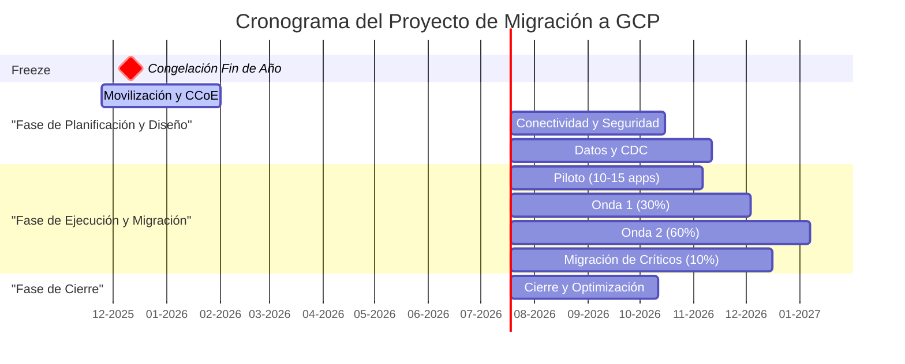

# Plan Maestro de Proyecto (Gantt)
**Proyecto**: Migración Industrial a Google Cloud Platform
**Fase**: 7.4 - Documentación Final
**Fecha**: 2025-11-01
**Responsable**: @devsecops, @admin-legados

---

## 1. Diagrama de Gantt Visual (Mermaid)

Este diagrama ofrece una visión de alto nivel del cronograma del proyecto a 18 meses, mostrando las fases principales y su solapamiento.

---

## 2. Plan de Proyecto Detallado

Esta tabla detalla las fases del proyecto, sus duraciones, dependencias, hitos clave y los agentes responsables.

| ID | Fase / Tarea | Inicio | Fin | Duración | Dependencias | Hito Clave (Go/No-Go) | Responsables Principales |
|:---|:---|:---|:---|:---|:---|:---|:---|
| **1** | **Movilización y CCoE** | 2025-11-24 | 2026-01-31 | 69 días | - | Charter del proyecto aprobado | @devsecops, @finanzas |
| **2** | **Conectividad y Seguridad** | 2026-02-01 | 2026-04-30 | 89 días | 1 | Dual Interconnect operativo; IAP configurado | @experto-redes, @devsecops |
| **3** | **Datos – OLA/CDC** | 2026-02-01 | 2026-05-26 | 116 días | 1 | **PoC de Debezium exitoso (<5% impacto)** | @data-engineer, @admin-legados |
| **4** | **Piloto (10-15 apps)** | 2026-05-01 | 2026-08-19 | 111 días | 2, 3 | Migración exitosa de 10 apps no críticas | @admin-legados, @data-engineer |
| **5** | **Onda 1 (≈30%)** | 2026-05-27 | 2026-10-13 | 139 días | 4 | 100 instancias SQL 2008-12 migradas | @admin-legados, @data-engineer |
| **6** | **Onda 2 (≈60%)** | 2026-10-14 | 2027-04-04 | 173 días | 5 | 90 apps IIS migradas; CDC para no críticos activo | @admin-legados, @data-engineer |
| **7** | **Migración de Críticos (≈10%)** | 2027-04-05 | 2027-09-02 | 151 días | 6 | 120 SQL 2019 críticos y SCADA antiguos integrados | @admin-legados, @arquitecto-plataforma |
| **8** | **Cierre y Optimización (BAU)** | 2027-09-03 | 2027-11-26 | 85 días | 7 | Infraestructura on-prem decomisionada | @devsecops, @finanzas |

**Notas sobre el Cronograma**:
- El plan se extiende por aproximadamente 24 meses para incluir holgura, aunque el objetivo de migración principal se completa en ~18-20 meses.
- Las fechas respetan el período de congelación de fin de año (15-Nov a 05-Ene), donde no se inician nuevas fases de ejecución críticas.
- El hito de la Fase 3 (PoC de Debezium) es un **Go/No-Go** crucial para la estrategia de migración de bases de datos.
