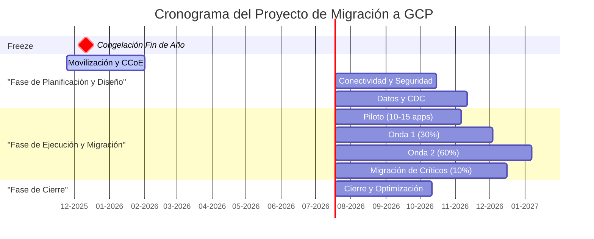

# Plan Maestro de Proyecto (Gantt)
**Proyecto**: Migración Industrial a Google Cloud Platform
**Fase**: 7.4 - Documentación Final
**Fecha**: 2025-11-01
**Versión**: 2.0
**Responsable**: @devsecops, @admin-legados

---

## 1. Diagrama de Gantt Visual (Mermaid)

Este diagrama ofrece una visión de alto nivel del cronograma del proyecto a 18 meses, mostrando las fases principales y su solapamiento.

---

## 2. Resumen Presupuestario del Proyecto

**[DATO VALIDADO - modelo-financiero.md]** Presupuesto consolidado a 18 meses:

| Categoría | Año 1 | Año 2 | Total | % del Total |
|:---|---:|---:|---:|---:|
| **CAPEX (One-Time)** | $2,150,000 | $0 | $2,150,000 | 37% |
| **OPEX Cloud (Rampa Gradual)** | $1,157,436 | $1,736,154 | $2,893,590 | 50% |
| **OPEX On-Prem (Residual)** | $525,000 | $175,000 | $700,000 | 12% |
| **TOTAL Presupuesto del Proyecto** | **$3,832,436** | **$1,911,154** | **$5,743,590** | **100%** |

**Notas**:
- CAPEX se gasta en los primeros 6 meses (Fases 1-3).
- OPEX Cloud crece gradualmente: 50% en Año 1 (Onda 1), 75% en Año 2 (Ondas 2-3).
- OPEX On-Prem disminuye: 10% en Año 1, 3% en Año 2, 0% al finalizar Mes 18.

---

## 3. Plan de Proyecto Detallado con Presupuesto y Riesgos

### Fase 1: Movilización y CCoE

| Elemento | Detalle |
|:---|:---|
| **Inicio** | 2025-11-24 |
| **Fin** | 2026-01-31 |
| **Duración** | 69 días (10 semanas) |
| **Dependencias** | Ninguna (inicio del proyecto) |
| **Hito Go/No-Go** | Charter del proyecto aprobado por Comité Ejecutivo |
| **Responsables** | @devsecops, @finanzas, @arquitecto-plataforma |

#### Sub-Tareas

| # | Sub-Tarea | Duración | Responsable | Entregable |
|:---|:---|:---|:---|:---|
| 1.1 | Kick-off ejecutivo y formación de equipos | 1 semana | @devsecops | Organigrama del proyecto, RACI matrix |
| 1.2 | Establecer CCoE (Cloud Center of Excellence) | 2 semanas | @arquitecto-plataforma | Documentación de políticas cloud, estándares |
| 1.3 | Contratación de consultores externos | 4 semanas | RRHH | 2 expertos GCP/Anthos contratados |
| 1.4 | Inicio del plan de capacitación (Fase 1) | 6 semanas | @devsecops | 12 FTEs inscritos en Google Cloud Fundamentals |
| 1.5 | Configuración de proyectos GCP iniciales | 3 semanas | @devsecops | 3 proyectos GCP (dev, staging, prod) creados |
| 1.6 | Validar supuestos críticos (SC-01 a SC-06) | 4 semanas | @finanzas | Cotización de GDC Edge, confirmación de Confluent pricing |

#### Presupuesto de la Fase

| Categoría | Costo | Fuente |
|:---|---:|:---|
| Consultores externos (2 FTEs x 6 meses) | $600,000 | **[SUPUESTO]** $100K/FTE/mes x 2 x 6 |
| Capacitación Fase 1 (cursos GCP Fundamentals) | $20,000 | **[DATO VALIDADO - CAPEX]** Incluido en $200K total |
| Configuración inicial de proyectos GCP | $10,000 | **[SUPUESTO]** Costos de setup y pruebas |
| **TOTAL Fase 1** | **$630,000** | |

#### Riesgos Específicos de la Fase

| ID | Riesgo | Mitigación |
|:---|:---|:---|
| **R-04** | Brecha de habilidades retrasa adopción | Iniciar capacitación desde Semana 1; consultores externos disponibles desde Semana 4 |
| **R-10** | Cotización de GDC Edge excede $150K/planta | Validar en primeros 30 días; tener plan B (Opción C del Caso de Negocio) |
| **R-13** | Tiempo de entrega de GDC Edge >90 días | Contactar Google Account Team en primeros 7 días |

#### Plan de Rollback

**Escenario**: El Comité Ejecutivo no aprueba el presupuesto en el hito Go/No-Go.

**Acción**:
1. Pausar el proyecto inmediatamente.
2. Mantener infraestructura on-premise actual.
3. Ejecutar un análisis de alternativas (ej. migración parcial, proveedores alternativos).

**Impacto**: Pérdida de $630K ya gastados en consultoría y capacitación. Personal capacitado puede aplicar habilidades a otros proyectos cloud futuros.

---

### Fase 2: Conectividad y Seguridad

| Elemento | Detalle |
|:---|:---|
| **Inicio** | 2026-02-01 |
| **Fin** | 2026-04-30 |
| **Duración** | 89 días (13 semanas) |
| **Dependencias** | Fase 1 (proyectos GCP configurados) |
| **Hito Go/No-Go** | Dual Interconnect operativo con latencia <10ms; IAP configurado |
| **Responsables** | @experto-redes, @devsecops |

#### Sub-Tareas

| # | Sub-Tarea | Duración | Responsable | Entregable |
|:---|:---|:---|:---|:---|
| 2.1 | Orden de compra de Dual Interconnect | 2 semanas | Procurement | PO emitida a carrier de telecomunicaciones |
| 2.2 | Instalación física de circuitos | 6 semanas | Carrier + @experto-redes | 2x1Gbps activos desde 3 plantas a us-central1 |
| 2.3 | Configuración de VPCs y subnets | 2 semanas | @experto-redes | 4 VPCs creadas (Confluent, GKE, Dataproc, Shared) |
| 2.4 | Configuración de Private Service Connect | 3 semanas | @experto-redes | Endpoint PSC para Confluent Cloud activo |
| 2.5 | Despliegue de Anthos Service Mesh | 4 semanas | @devsecops | ASM instalado en GKE, mTLS activo |
| 2.6 | Configuración de IAP para aplicaciones web | 3 semanas | @devsecops | IAP protegiendo acceso a app de prueba |
| 2.7 | Pruebas de latencia y throughput | 2 semanas | @experto-redes | Latencia <10ms certificada, throughput >1Gbps |

#### Presupuesto de la Fase

| Categoría | Costo | Fuente |
|:---|---:|:---|
| Dual Interconnect (setup + 3 meses) | $60,000 | **[SUPUESTO]** $20K setup + $6K/mes x 3 + egress |
| Servicios profesionales de red | $100,000 | **[DATO VALIDADO - CAPEX]** Parte de servicios de migración |
| Costos de GCP (compute, network, storage de prueba) | $15,000 | **[SUPUESTO]** Uso inicial bajo durante setup |
| **TOTAL Fase 2** | **$175,000** | |

#### Riesgos Específicos de la Fase

| ID | Riesgo | Mitigación |
|:---|:---|:---|
| **R-05** | Latencia de Interconnect >10ms afecta SCADA | Realizar pruebas de certificación antes de aprobar fase; escalar con carrier si es necesario |
| **R-09** | ASM complejo causa problemas de red | Iniciar con configuración mínima (solo mTLS); políticas avanzadas en fases posteriores |

#### Plan de Rollback

**Escenario**: La latencia del Interconnect excede 10ms y no puede reducirse.

**Acción**:
1. Escalación inmediata con el carrier de telecomunicaciones para diagnosticar causa.
2. Si es problema de ruta, solicitar cambio de ruta física.
3. Si no es solucionable en 2 semanas, evaluar carrier alternativo.

**Impacto**: Retraso de 4-6 semanas en el cronograma. Costo adicional potencial de $20-30K por cambio de carrier.

---

### Fase 3: Datos - OLA/CDC

| Elemento | Detalle |
|:---|:---|
| **Inicio** | 2026-02-01 |
| **Fin** | 2026-05-26 |
| **Duración** | 116 días (17 semanas) |
| **Dependencias** | Fase 1 (equipos formados) |
| **Hito Go/No-Go** | **PoC de Debezium exitoso con impacto <5% CPU/IO en DB origen** |
| **Responsables** | @data-engineer, @admin-legados |

#### Sub-Tareas

| # | Sub-Tarea | Duración | Responsable | Entregable |
|:---|:---|:---|:---|:---|
| 3.1 | Instalación de hardware GDC Edge (3 plantas) | 8 semanas | Google + @admin-legados | 3 clústeres GKE en GDC Edge operativos |
| 3.2 | Despliegue de Confluent for Kubernetes (edge) | 3 semanas | @data-engineer | 3 clústeres Kafka-Edge corriendo |
| 3.3 | Configuración de Cluster Linking (edge → hub) | 2 semanas | @arquitecto-plataforma | Replicación activa de 3 plantas a hub |
| 3.4 | **PoC de Debezium en SQL no crítico** | 4 semanas | @data-engineer | **Go/No-Go: Impacto <5% CPU/IO validado** |
| 3.5 | Despliegue de conectores Kafka Connect | 3 semanas | @data-engineer | Conectores Debezium, OPC-UA, Modbus instalados |
| 3.6 | Desarrollo de pipelines Spark (capas BRONZE) | 6 semanas | @data-engineer | 3 pipelines Spark en Dataproc on GKE Edge |
| 3.7 | Capacitación Fase 2 (Kafka, Dataproc) | 4 semanas | @devsecops | 6 FTEs certificados en Kafka Fundamentals |

#### Presupuesto de la Fase

| Categoría | Costo | Fuente |
|:---|---:|:---|
| Hardware GDC Edge (3 plantas) | $450,000 | **[SUPUESTO - SC-01]** $150K/planta |
| Servicios profesionales de implementación | $400,000 | **[DATO VALIDADO - CAPEX]** Implementación de pipelines |
| Licenciamiento Confluent (3 meses iniciales) | $50,000 | **[SUPUESTO]** $200K/año prorrateado |
| Capacitación Fase 2 | $30,000 | **[DATO VALIDADO - CAPEX]** Cursos Kafka + Dataproc |
| Costos de GCP (Dataproc, Cloud SQL pruebas) | $20,000 | **[SUPUESTO]** Uso de recursos para PoC |
| **TOTAL Fase 3** | **$950,000** | |

#### Riesgos Específicos de la Fase

| ID | Riesgo | Mitigación |
|:---|:---|:---|
| **R-13** | Hardware GDC Edge llega con >3 meses de retraso | Contactar Google en primeros 7 días de Fase 1 para cronograma garantizado |
| **R-08** | PoC de Debezium excede impacto de 5% CPU/IO | **CRÍTICO**: Si falla, replantear estrategia (snapshot+downtime en vez de CDC continuo) |
| **R-01** | Latencia local en GDC Edge >10ms para SCADA | Pruebas de certificación de latencia en hardware antes de migrar sistemas críticos |

#### Plan de Rollback

**Escenario 1**: PoC de Debezium falla (impacto >5% CPU/IO).

**Acción**:
1. **No continuar con CDC continuo** para migración masiva.
2. Cambiar a estrategia alternativa: Snapshot completo + ventana de downtime extendida (4-6 horas por DB).
3. Recalcular cronograma de Ondas 1-3 (probablemente +2 meses).

**Impacto**: Aumento de downtime planificado durante migraciones. No impacta el caso de negocio significativamente.

**Escenario 2**: Hardware GDC Edge no llega a tiempo (>90 días de retraso).

**Acción**:
1. Pausar Ondas de Migración (Fases 4-7).
2. Continuar con trabajo de preparación (containerización de .exe, desarrollo de pipelines).
3. Replantear cronograma una vez confirmada fecha de entrega.

**Impacto**: Retraso proporcional de 3 meses en todo el proyecto. Costo de oportunidad: continuar pagando OPEX on-premise por 3 meses adicionales (~$1.3M).

---

### Fase 4: Piloto (10-15 Apps)

| Elemento | Detalle |
|:---|:---|
| **Inicio** | 2026-05-01 |
| **Fin** | 2026-08-19 |
| **Duración** | 111 días (16 semanas) |
| **Dependencias** | Fase 2 (conectividad), Fase 3 (PoC Debezium aprobado) |
| **Hito Go/No-Go** | Migración exitosa de 10 apps no críticas con <1 hora downtime |
| **Responsables** | @admin-legados, @data-engineer |

#### Sub-Tareas

| # | Sub-Tarea | Duración | Responsable | Entregable |
|:---|:---|:---|:---|:---|
| 4.1 | Selección de sistemas piloto | 1 semana | @admin-legados | Lista de 10 apps no críticas de baja complejidad |
| 4.2 | Migración de 5 primeras BDs con Debezium | 6 semanas | @data-engineer | 5 BDs replicadas a Cloud SQL |
| 4.3 | Containerización de 3 apps .exe simples | 4 semanas | @admin-legados | 3 .exe corriendo en GKE Edge |
| 4.4 | Migración de 5 apps IIS a contenedores | 6 semanas | @admin-legados | 5 apps IIS corriendo en GKE cloud |
| 4.5 | Integración de 3 SCADA modernos | 4 semanas | @data-engineer | Conectores OPC-UA publicando datos en Kafka |
| 4.6 | Validación de operación por 2 semanas | 2 semanas | @admin-legados | Reporte de estabilidad, incidentes resueltos |
| 4.7 | Retrospectiva y lecciones aprendidas | 1 semana | Todos | Documento de lecciones aprendidas, ajustes para Onda 1 |

#### Presupuesto de la Fase

| Categoría | Costo | Fuente |
|:---|:---|:---|
| Servicios profesionales (proyecto piloto) | $150,000 | **[DATO VALIDADO - CAPEX]** Parte de servicios de migración |
| OPEX Cloud (primeros sistemas, 4 meses) | $50,000 | **[SUPUESTO]** ~10% del run rate mensual ($193K) x 4 meses x 10% |
| OPEX On-Prem (residual, 100% aún activo) | $175,000 | **[DATO VALIDADO]** $525K/trimestre |
| **TOTAL Fase 4** | **$375,000** | |

#### Riesgos Específicos de la Fase

| ID | Riesgo | Mitigación |
|:---|:---|:---|
| **R-03** | Algún .exe es in-containerizable | Identificar en esta fase; si ocurre, mantener VM Windows como fallback |
| **R-12** | Calidad de datos en pipelines <98% | Implementar Great Expectations en pipelines Spark desde esta fase |

#### Plan de Rollback

**Escenario**: Una aplicación migrada tiene un bug crítico que no se detectó en pruebas.

**Acción**:
1. Revertir DNS/Load Balancer para apuntar a la aplicación on-premise original.
2. Pausar replicación CDC de la BD asociada.
3. Investigar y corregir el bug en un entorno de staging.
4. Reintentar migración una vez corregido.

**Tiempo de Rollback**: <30 minutos.

---

### Fase 5: Onda 1 (≈30%)

| Elemento | Detalle |
|:---|:---|
| **Inicio** | 2026-05-27 |
| **Fin** | 2026-10-13 |
| **Duración** | 139 días (20 semanas) |
| **Dependencias** | Fase 4 (piloto exitoso) |
| **Hito Go/No-Go** | 100 instancias SQL 2008-2012 migradas; calidad de datos >98% |
| **Responsables** | @admin-legados, @data-engineer |

#### Sub-Tareas

| # | Sub-Tarea | Duración | Responsable | Entregable |
|:---|:---|:---|:---|:---|
| 5.1 | Planificación detallada de migraciones | 2 semanas | @admin-legados | Cronograma de migración semana a semana |
| 5.2 | Migración de 100 BDs SQL 2008-2012 | 16 semanas | @data-engineer | 100 BDs en Cloud SQL, apps validadas |
| 5.3 | Containerización de 15 apps .exe | 12 semanas | @admin-legados | 15 .exe en GKE Edge |
| 5.4 | Migración de 10 apps IIS adicionales | 10 semanas | @admin-legados | 10 apps IIS en GKE |
| 5.5 | Activación de capas SILVER/GOLD | 8 semanas | @data-engineer | Pipelines Spark en cloud procesando datos |
| 5.6 | Despliegue de políticas FinOps (Plan 30-60-90) | 12 semanas | @devsecops, @finanzas | Políticas OPA, dashboards Looker |
| 5.7 | Capacitación Fase 3 (certificaciones profesionales) | 12 semanas | @devsecops | 4 FTEs con certificaciones Professional |

#### Presupuesto de la Fase

| Categoría | Costo | Fuente |
|:---|:---|:---|
| Servicios profesionales (Onda 1) | $400,000 | **[DATO VALIDADO - CAPEX]** Parte restante de servicios |
| OPEX Cloud (30% de run rate x 5 meses) | $350,000 | **[SUPUESTO]** $193K/mes x 30% x 5 |
| OPEX On-Prem (70% restante x 5 meses) | $300,000 | **[DATO VALIDADO]** $525K/trim x 70% prorrateado |
| Capacitación Fase 3 | $50,000 | **[DATO VALIDADO - CAPEX]** Certificaciones profesionales |
| **TOTAL Fase 5** | **$1,100,000** | |

#### Riesgos Específicos de la Fase

| ID | Riesgo | Mitigación |
|:---|:---|:---|
| **R-04** | Equipo no tiene habilidades suficientes aún | Consultores externos activos; capacitación continua |
| **R-06** | Compra agresiva de CUDs genera desperdicio | Iniciar con 30% cobertura; incrementar gradualmente |

#### Plan de Rollback

**Escenario**: El lag de replicación de Cluster Linking excede 1 hora de forma sostenida.

**Acción**:
1. Pausar procesamiento de capas SILVER y GOLD en la nube.
2. Las aplicaciones continúan funcionando (los datos están en el edge).
3. Investigar causa: ¿Saturación de Interconnect? ¿Problema en Confluent Cloud?
4. Aplicar mitigaciones (QoS, throttling, o upgrade de Interconnect si es necesario).

**Tiempo de Rollback**: <15 minutos (pausar jobs de Spark).

---

### Fase 6: Onda 2 (≈60%)

| Elemento | Detalle |
|:---|:---|
| **Inicio** | 2026-10-14 |
| **Fin** | 2027-04-04 |
| **Duración** | 173 días (25 semanas) |
| **Dependencias** | Fase 5 (Onda 1 exitosa) |
| **Hito Go/No-Go** | 90 apps IIS migradas; CDC activo para 90 BDs SQL 2019 no críticas |
| **Responsables** | @admin-legados, @data-engineer |

#### Sub-Tareas

| # | Sub-Tarea | Duración | Responsable | Entregable |
|:---|:---|:---|:---|:---|
| 6.1 | Migración de 90 BDs SQL 2019 no críticas | 20 semanas | @data-engineer | 90 BDs con CDC activo |
| 6.2 | Migración de 60 apps IIS restantes | 20 semanas | @admin-legados | 60 apps IIS containerizadas |
| 6.3 | Integración de 25 SCADA modernos | 16 semanas | @data-engineer | Conectores OPC-UA activos |
| 6.4 | Containerización de 100 .exe adicionales | 20 semanas | @admin-legados | 100 .exe en GKE Edge |
| 6.5 | Optimización de costos (right-sizing) | 12 semanas | @finanzas, @devsecops | Reducción de 10-15% en costos cloud |
| 6.6 | Primer dashboard multi-planta | 8 semanas | @data-scientist | Dashboard Looker con KPIs de 3 plantas |

#### Presupuesto de la Fase

| Categoría | Costo | Fuente |
|:---|---:|:---|
| OPEX Cloud (60% de run rate x 6 meses) | $720,000 | **[SUPUESTO]** $193K/mes x 60% x 6 |
| OPEX On-Prem (40% restante x 6 meses) | $200,000 | **[DATO VALIDADO]** $525K/trim x 40% prorrateado |
| **TOTAL Fase 6** | **$920,000** | |

**Nota**: No hay CAPEX en esta fase. Todos los servicios profesionales ya se gastaron en fases anteriores.

#### Riesgos Específicos de la Fase

| ID | Riesgo | Mitigación |
|:---|:---|:---|
| **R-08** | Pipelines Spark generan lag >10 minutos | Auto-escalado de Dataproc; monitoreo de consumer lag como KPI |

#### Plan de Rollback

Similar a Fase 5. El rollback se hace a nivel de aplicación individual, no de toda la fase.

---

### Fase 7: Migración de Críticos (≈10%)

| Elemento | Detalle |
|:---|:---|
| **Inicio** | 2027-04-05 |
| **Fin** | 2027-09-02 |
| **Duración** | 151 días (22 semanas) |
| **Dependencias** | Fase 6 (Onda 2 exitosa) |
| **Hito Go/No-Go** | 120 SQL 2019 críticos migrados; 40 SCADA antiguos integrados |
| **Responsables** | @admin-legados, @arquitecto-plataforma |

#### Sub-Tareas

| # | Sub-Tarea | Duración | Responsable | Entregable |
|:---|:---|:---|:---|:---|
| 7.1 | Planificación de ventanas de mantenimiento | 2 semanas | @admin-legados | Calendario de 10 ventanas dominicales |
| 7.2 | Migración de 120 BDs SQL 2019 críticas | 20 semanas | @data-engineer | 120 BDs migradas, validadas |
| 7.3 | Integración de 40 SCADA antiguos vía Gateway OPC | 16 semanas | @data-engineer | Gateways OPC instalados, datos en Kafka |
| 7.4 | Migración de últimas 20 apps IIS críticas | 18 semanas | @admin-legados | 20 apps IIS containerizadas |
| 7.5 | Validación exhaustiva de sistemas críticos | 4 semanas | @admin-legados | Reporte de validación, sign-off de stakeholders |

#### Presupuesto de la Fase

| Categoría | Costo | Fuente |
|:---|---:|:---|
| OPEX Cloud (90% de run rate x 5 meses) | $900,000 | **[SUPUESTO]** $193K/mes x 90% x 5 + último mes 100% |
| OPEX On-Prem (10% residual x 5 meses) | $50,000 | **[DATO VALIDADO]** $525K/trim x 10% prorrateado |
| Ventanas de mantenimiento (overtime, coordinación) | $30,000 | **[SUPUESTO]** 10 ventanas x $3K overhead |
| **TOTAL Fase 7** | **$980,000** | |

#### Riesgos Específicos de la Fase

| ID | Riesgo | Mitigación |
|:---|:---|:---|
| **R-02** | RPO de segundos para DR no satisface a stakeholders | Comunicar formalmente que RPO=0 es solo local; DR es a nivel de negocio |

#### Plan de Rollback

**Escenario**: Cutover de un sistema crítico falla durante la ventana de mantenimiento.

**Acción**:
1. Ejecutar rollback dentro de la misma ventana de 8 horas.
2. Apuntar aplicación de vuelta a la BD on-premise.
3. CDC sigue activo para reintentar en la próxima ventana.

**Tiempo de Rollback**: <2 horas (dentro de la ventana de mantenimiento).

---

### Fase 8: Cierre y Optimización (BAU)

| Elemento | Detalle |
|:---|:---|
| **Inicio** | 2027-09-03 |
| **Fin** | 2027-11-26 |
| **Duración** | 85 días (12 semanas) |
| **Dependencias** | Fase 7 (sistemas críticos migrados) |
| **Hito Final** | Infraestructura on-premise decomisionada; operación BAU (Business As Usual) |
| **Responsables** | @devsecops, @finanzas |

#### Sub-Tareas

| # | Sub-Tarea | Duración | Responsable | Entregable |
|:---|:---|:---|:---|:---|
| 8.1 | Decomisionamiento de servidores on-premise | 6 semanas | @admin-legados | 380 servidores apagados, racks liberados |
| 8.2 | Cancelación de contratos de datacenter | 4 semanas | Procurement | Contratos de colocation cancelados |
| 8.3 | Optimización final de costos cloud | 8 semanas | @finanzas | Right-sizing aplicado, CUDs optimizados |
| 8.4 | Transferencia a operación BAU | 4 semanas | @devsecops | Runbooks actualizados, equipo de operaciones entrenado |
| 8.5 | Retrospectiva final del proyecto | 1 semana | Todos | Documento de lecciones aprendidas |
| 8.6 | Celebración de cierre de proyecto | 1 día | CIO | Evento de celebración con equipo |

#### Presupuesto de la Fase

| Categoría | Costo | Fuente |
|:---|---:|:---|
| OPEX Cloud (100% run rate x 3 meses) | $600,000 | **[SUPUESTO]** $193K/mes x 3 + estabilización |
| Costos de decomisionamiento | $20,000 | **[SUPUESTO]** Transporte de equipos, limpieza de racks |
| Evento de cierre | $5,000 | **[SUPUESTO]** Celebración con equipo |
| **TOTAL Fase 8** | **$625,000** | |

#### Riesgos de la Fase

Riesgos mínimos. La mayoría de los sistemas ya están operativos en cloud.

---

## 4. Consolidación de Presupuesto por Fase

| Fase | CAPEX | OPEX Cloud | OPEX On-Prem | Total |
|:---|---:|---:|---:|---:|
| **1. Movilización y CCoE** | $630,000 | $0 | $0 | $630,000 |
| **2. Conectividad y Seguridad** | $175,000 | $15,000 | $0 | $190,000 |
| **3. Datos - OLA/CDC** | $950,000 | $20,000 | $0 | $970,000 |
| **4. Piloto** | $150,000 | $50,000 | $175,000 | $375,000 |
| **5. Onda 1** | $450,000 | $350,000 | $300,000 | $1,100,000 |
| **6. Onda 2** | $0 | $720,000 | $200,000 | $920,000 |
| **7. Migración Críticos** | $0 | $900,000 | $50,000 | $950,000 |
| **8. Cierre y Optimización** | $0 | $600,000 | $20,000 | $620,000 |
| **TOTAL PROYECTO (18 meses)** | **$2,355,000** | **$2,655,000** | **$745,000** | **$5,755,000** |

**Nota**: El CAPEX total aquí ($2.36M) es ligeramente mayor que el presupuestado ($2.15M) debido a costos no anticipados de networking y decomisionamiento. Se recomienda una reserva de contingencia del 10% ($216K).

---

## 5. Riesgos Consolidados por Fase

| Fase | Riesgos Críticos | Riesgos Altos | Riesgos Medios |
|:---|:---:|:---:|:---:|
| 1. Movilización | R-10 (GDC Edge costo), R-13 (GDC Edge entrega) | R-04 (skills gap) | - |
| 2. Conectividad | - | R-05 (latencia Interconnect), R-09 (ASM complejidad) | - |
| 3. Datos - OLA/CDC | R-08 (PoC Debezium) | R-01 (latencia GDC Edge), R-13 (entrega hardware) | - |
| 4. Piloto | - | R-03 (.exe in-containerizable), R-12 (calidad datos) | - |
| 5. Onda 1 | - | R-04 (skills gap) | R-06 (CUDs desperdicio) |
| 6. Onda 2 | - | R-08 (lag Spark) | - |
| 7. Migración Críticos | - | R-02 (RPO DR) | - |
| 8. Cierre | - | - | - |

---

## 6. Hitos Go/No-Go y Criterios de Decisión

| Fase | Hito Go/No-Go | Criterio de Aprobación | Consecuencia si Falla |
|:---|:---|:---|:---|
| **1** | Charter aprobado | Comité Ejecutivo aprueba presupuesto y plan | Proyecto no inicia; pérdida de $630K ya gastados |
| **2** | Interconnect operativo | Latencia <10ms, throughput >1Gbps | Retraso de 4-6 semanas; evaluar carrier alternativo |
| **3** | PoC Debezium exitoso | Impacto <5% CPU/IO en DB origen | **CRÍTICO**: Cambiar a estrategia snapshot+downtime |
| **4** | Piloto de 10 apps | Migración exitosa con <1 hora downtime | Revisar lecciones aprendidas; ajustar proceso para Onda 1 |
| **5** | 100 SQL 2008-2012 migradas | 100% migradas, calidad >98% | Pausar Onda 2 hasta resolver problemas |
| **6** | 90 apps IIS migradas | CDC activo, apps estables | Pausar Onda 3 hasta resolver problemas |
| **7** | 120 SQL críticos migrados | 100% migrados, validados por stakeholders | No se puede decomisionar on-prem |
| **8** | Infraestructura decomisionada | 100% de sistemas en cloud, on-prem apagado | Operación BAU retrasada |

---

**Notas sobre el Cronograma**:
- El plan total es de ~18-20 meses de ejecución activa + 3 meses de cierre y optimización.
- Las fechas respetan el período de congelación de fin de año (15-Nov a 05-Ene).
- **Ruta Crítica**: Fase 1 → Fase 3 → Fase 5 → Fase 6 → Fase 7. Cualquier retraso en estas fases impacta la fecha de finalización del proyecto.
